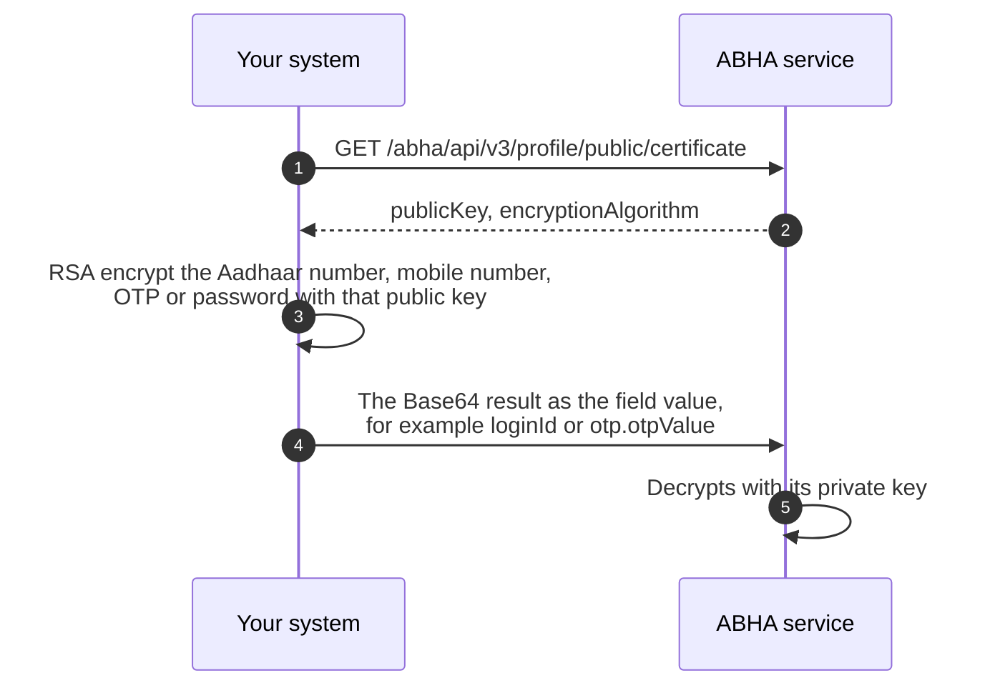

# Why identifiers are encrypted, and where to do it

## In plain words

We publish the public half of a key pair. You encrypt with it. Only our private half can decrypt. Your system never holds a secret to do this, only the current certificate.

There is nothing ABDM specific in the mechanics. Your platform's standard RSA library does the work. Both keys use `RSA/ECB/OAEPWithSHA-1AndMGF1Padding`. The one thing to confirm is which key you are using.

Read `encryptionAlgorithm` from the certificate response and encrypt with what it names. Code that reads the field survives a change of algorithm. Code that cannot recognise what the field names should refuse to encrypt rather than fall back to a default.

## Before you start

The certificate from `GET /abha/api/v3/profile/public/certificate`, which carries `publicKey` and `encryptionAlgorithm`.

## What happens

Put the plaintext in the shape the service validates after it decrypts, from the table above: an ABHA number keeps its dashes. Encrypt with the algorithm the response names and send the base64 result as the field value, for example `loginId`.

## How you know it worked

The raw Aadhaar or mobile number exists only inside your own process, for the length of the call, and never reaches a log. A call carrying your ciphertext passes validation.

## When it goes wrong

`400 {"loginId": "LoginId is invalid"}` means the value decrypted and the plaintext failed a format rule, usually an ABHA number sent without its dashes. Logging the plain value before encryption is the same leak, moved into your log store.
