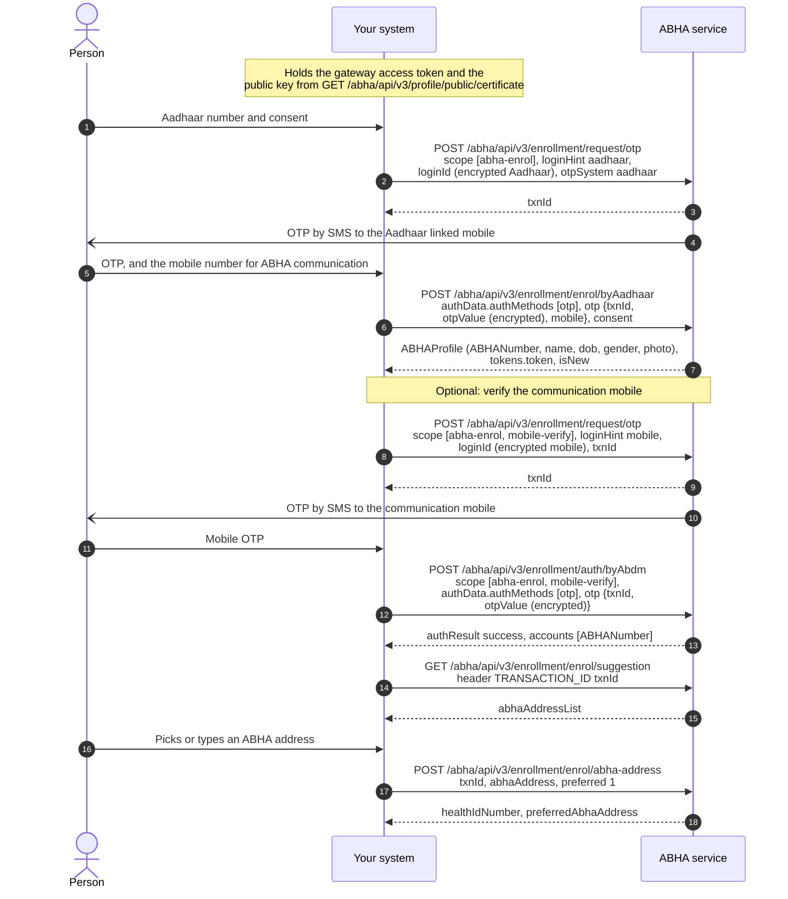

# Create an ABHA using an Aadhaar OTP

## In plain words

The individual provides their Aadhaar number. The ABHA service sends a one time
password ([OTP](/docs/hiecm/v3/getting-started/glossary#otp)) to the mobile number registered against that Aadhaar.
Upon successful verification, the individual selects an ABHA address, and the
ABHA number is issued.

Every step answers in its own response, so nothing here waits on a callback.
The enrolment call is the one with a lasting effect: it creates the account.

## Before you start

A gateway access token, the Aadhaar number encrypted with the M1 certificate, the person present to read the OTP, and their consent to create an ABHA.

## What happens

Request the OTP with scope `abha-enrol` and keep the `txnId`. Enrol with `enrol/byAadhaar`, sending the encrypted OTP, the communication mobile and the consent block. Optionally verify the communication mobile. Fetch suggestions with the `TRANSACTION_ID` header, and claim the chosen address with `preferred` set to 1.

## How you know it worked

The enrolment response carries `ABHAProfile` with an `ABHANumber`, and the address step returns the chosen address as `preferredAbhaAddress`. An account left with only its default address is a half finished job the person will not recognise later.

## When it goes wrong

The OTP goes only to the mobile registered against the Aadhaar, which may not be the phone in the room: see [the OTP never arrives](/docs/hiecm/v3/troubleshooting/otp-never-arrives). Enrolment for an Aadhaar that already has an ABHA returns that account with `isNew` false, so read `isNew` before telling the person anything was created. Every call failing the same way is a session or header problem: see [everything returns 401](/docs/hiecm/v3/troubleshooting/everything-returns-401).
