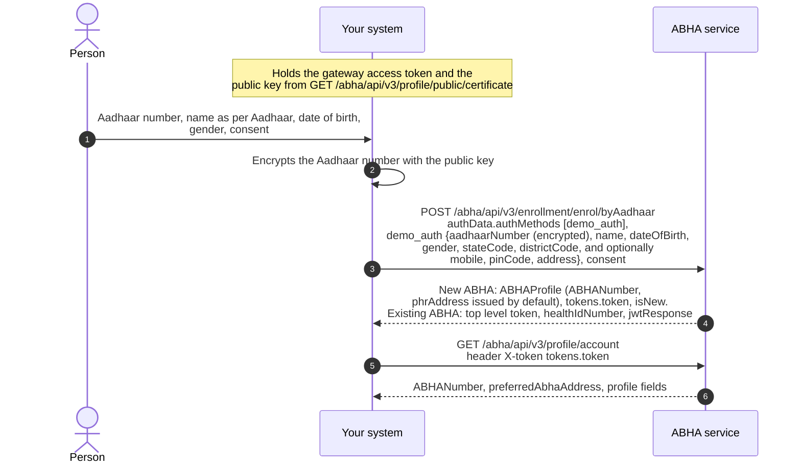

# Create an ABHA using Aadhaar demographic authentication

## In plain words

This onboarding pathway is intended for eligible government programme
integrations in accordance with ABDM guidelines. Unlike OTP-based or biometric
authentication workflows, demographic authentication relies on validation of
Aadhaar demographic information, including name, date of birth, and gender,
through the prescribed verification process.

The `enrol/byAadhaar` API is invoked with the appropriate authentication method
and encrypted demographic details as specified in the implementation
guidelines. Implementers should account for the response structure defined for
this workflow, including user token handling and ABHA address generation
behaviour. A system-generated ABHA address may be assigned during account
creation, and organizations may provide users with the option to configure a
more user-friendly ABHA address where permitted. Any demographic verification
failures should be handled in accordance with the error codes and response
specifications published by ABDM.

## Before you start

Approval for this route, the gateway access token, the M1 certificate, the `Benefit-Name` header value, and the person's name exactly as Aadhaar holds it, with date of birth and gender. A near miss on any of them is a refusal, not a warning.

## What happens

One call creates the account: `enrol/byAadhaar` with `authMethods` set to `demo_auth` and a `demo_auth` block carrying the encrypted `aadhaarNumber`, `name`, `dateOfBirth`, `gender`, `stateCode` and `districtCode`. If an ABHA already exists for the Aadhaar, the call returns it rather than creating a second.

## How you know it worked

The response carries the ABHA number and a user token, and the profile read with that token returns the same account. The response has two shapes: the token is either `tokens.token` or a top level `token` beside `healthIdNumber`. Parse both.

## When it goes wrong

Parsing only `tokens.token` reads nothing from the other shape. The account arrives with a default address nobody can remember, so offer a readable one from the address suggestions.
