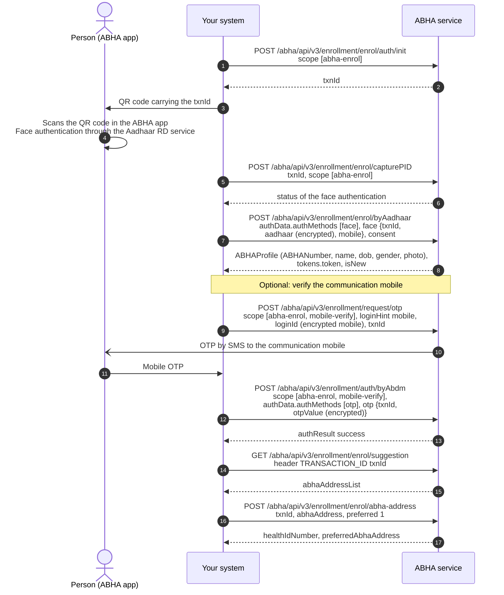

# Create an ABHA using Aadhaar face authentication

## In plain words

Individuals who are unable to use OTP-based authentication, including cases
where the mobile number linked to Aadhaar is unavailable or inaccessible, may
use face authentication as an alternative verification mechanism, subject to
ABDM and UIDAI guidelines. Face authentication is performed through authorized
Aadhaar Registered Device (RD) services using approved authentication
workflows.

ABDM documentation references biometric-based ABHA creation workflows,
including face authentication and other supported biometric modalities where
applicable. Organizations should implement authentication methods in accordance
with the officially published specifications and follow them before
proceeding with production deployment.

The middle of this journey happens on the person's phone, not in your system.
Show that you are waiting for them rather than a spinner.

## Before you start

Everything the Aadhaar OTP journey needs, the ABHA app on the person's phone, and a screen that can show a QR code.

## What happens

Call `enrol/auth/init` for a `txnId` and show it as a QR code. Poll `capturePID` every 5 to 10 seconds: its status moves through PENDING, VERIFIED, FAILED and COMPLETE. On COMPLETE, call `enrol/byAadhaar` with the face auth method and the same `txnId`, then claim an address as in the OTP journey.

## How you know it worked

`capturePID` reports COMPLETE and `enrol/byAadhaar` returns an `ABHAProfile` with an `ABHANumber`. The capture being accepted is the event, not the app saying the scan succeeded.

## When it goes wrong

The person has no ABHA app: installing it is part of the journey, not an error. The capture reports FAILED: capture again rather than resubmitting. Nothing pushes the result to you, so keep polling or continue once the person confirms.
