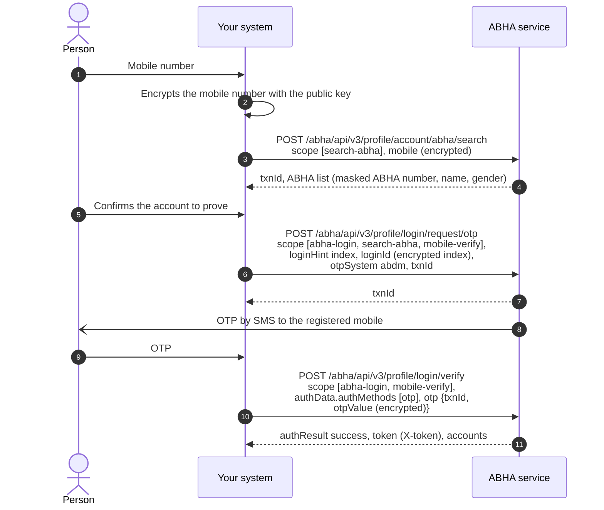

# Find somebody's ABHA when they do not know it

## In plain words

This workflow enables discovery of an existing ABHA using a registered mobile
number when an individual does not readily know their ABHA details. Upon
successful verification of the mobile number, the system may return limited,
non-sensitive information such as the individual's name, gender, and masked
ABHA number, allowing confirmation of whether an ABHA has already been created.

Access to complete profile information and sensitive account details requires
successful authentication through approved mechanisms such as OTP, biometric
authentication, or face authentication. All identifiers and personal
information must be encrypted and processed within the integrating system in
accordance with ABDM security, privacy, and data protection requirements. See
[encryption](/docs/hiecm/v3/concepts/encryption) for how to do it locally.

## Before you start

A gateway access token, the mobile number the person remembers, encrypted with the M1 certificate, and the person present to read the OTP.

## What happens

Search with scope `search-abha`. The response carries a `txnId` and the accounts on that mobile, each with an `index`, a masked ABHA number, name and gender. Show those and let the person pick. Request the OTP with `loginHint` set to `index`, the encrypted index as `loginId` and the same `txnId`, then verify it.

## How you know it worked

Verification succeeds and returns the account the person recognised from the masked details.

## When it goes wrong

The search finds nothing: the number may hold no ABHA, or the ABHA may sit in the other environment. The person does not recognise any account: stop, because continuing would disclose somebody else's. Never skip the OTP because the search already returned an account: search alone is a lookup of somebody's identity.
