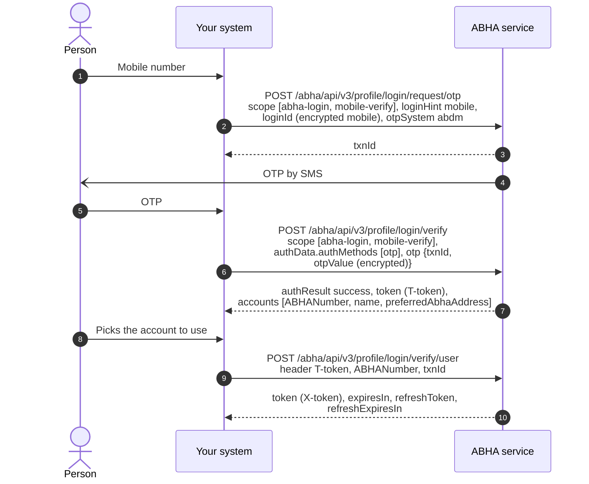

# Log somebody in to their existing ABHA

## In plain words

ABHA login using a registered mobile number enables individuals to securely
access their ABHA-linked profile and services through a mobile OTP-based
authentication process. Since a single mobile number may be associated with
multiple ABHA accounts, the user may be required to select the appropriate ABHA
account after successful verification. Upon completion of the authentication
process, authorized access is granted to the individual's ABHA profile and
associated services in accordance with ABDM guidelines.

## Before you start

A gateway access token, the mobile number encrypted with the M1 certificate, and the person present to read the OTP.

## What happens

Request the OTP with scope `abha-login` and `mobile-verify` and `loginHint` set to `mobile`. Verify it: the response carries a short lived token and `accounts`. Always call `/abha/api/v3/profile/login/verify/user` with the chosen `ABHANumber`, the same `txnId` and that token in the `T-token` header, even when `accounts` holds one entry. It returns the `X-token` profile calls need.

## How you know it worked

A profile read with the `X-token` returns the account the person expected. With several accounts on one mobile, the account read back is the check, not the presence of a token.

## When it goes wrong

Several accounts are normal on a shared family phone, so show a chooser. A profile call refused with `ABDM-1094`, X-token expired, on a new token usually means the token from login verify was sent instead of the one from verify user. Never send the gateway session token in `X-token`.
