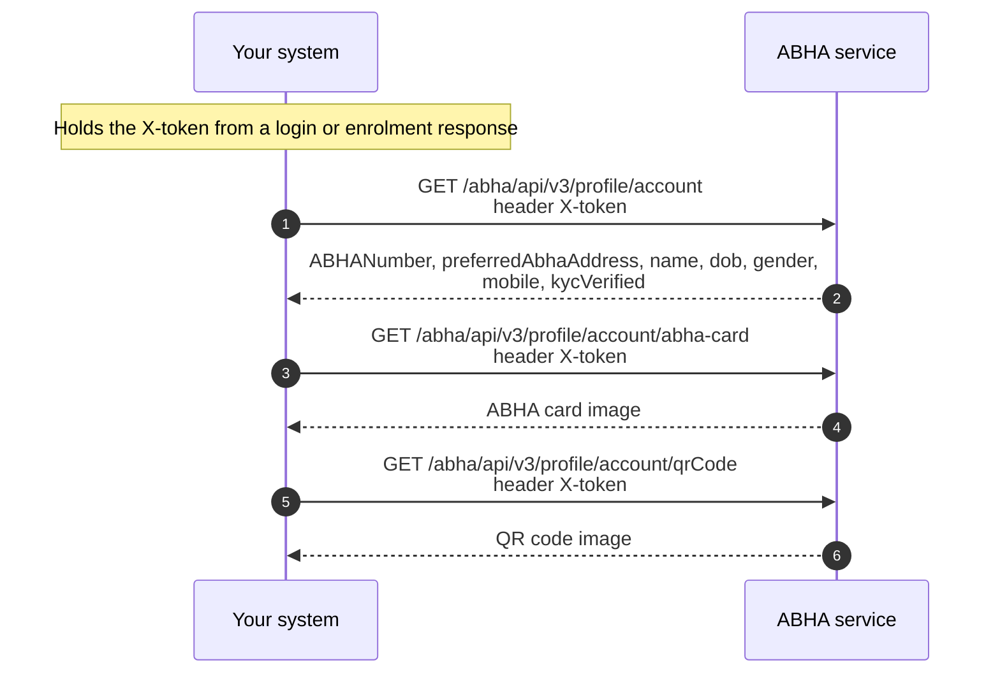

# Change the mobile number on an ABHA profile

## In plain words

This functionality enables retrieval and management of an individual's ABHA
profile following successful authentication. Authorized users can access
profile information, view their ABHA card, and retrieve the associated Quick
Response (QR) code, which serves as a digital representation of the ABHA
identifier for use across ABDM-enabled healthcare services.

The workflow also supports profile updates in accordance with applicable ABDM
guidelines, ensuring that health identity information remains accurate and up
to date while complying with prescribed security, privacy, and authentication
requirements.

Changing the mobile number is two calls with an OTP to the new number between
them: `POST /abha/api/v3/profile/account/request/otp` with scope
`abha-profile` and `mobile-verify`, then
`POST /abha/api/v3/profile/account/verify` with the same scope and the OTP.
Both carry the person's `X-token`.

## Before you start

The person logged in, so you hold their `X-token`, the new mobile number encrypted with the M1 certificate, and the person holding the new phone.

## What happens

Request the OTP with scope `abha-profile` and `mobile-verify`, `loginHint` set to `mobile` and the encrypted new number as `loginId`. Verify with the same scope, the `txnId` and the encrypted OTP.

## How you know it worked

Verify answers with `authResult` success, and a profile read afterwards shows the new number.

## When it goes wrong

The OTP goes to the new number, not the old one, so a person who cannot receive it there cannot change it. A scope on the verify call that differs from the request is refused: send the same array on both.
