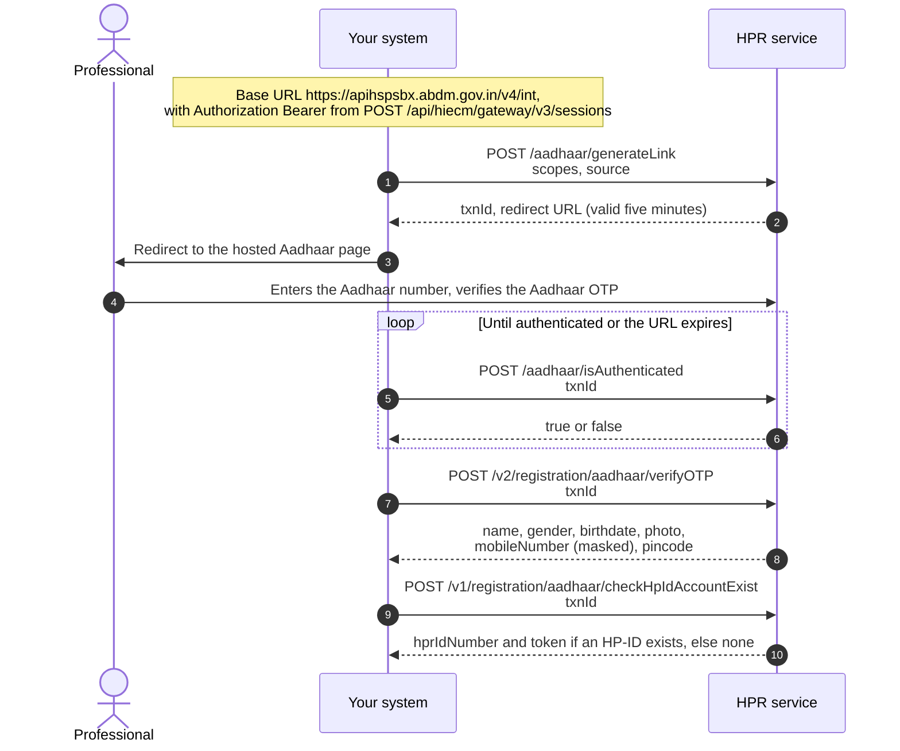
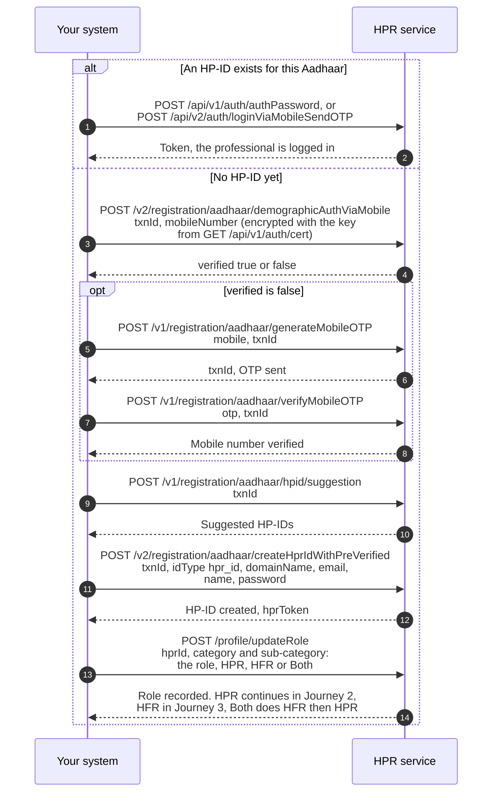

# Get a healthcare professional an HPID

## In plain words

### Aadhaar authentication

The professional authenticates using Aadhaar. The integrating system does not handle the Aadhaar number or [OTP](/docs/hiecm/v3/getting-started/glossary#otp). Instead, it handles the transaction ID and redirects the user to the URL returned by the HPR service.

The URL is valid for five minutes. If it expires before authentication is completed, call Generate Aadhaar Link again to obtain a new authentication URL. After authentication the professional selects the role to register for: HPR, HFR, or both.

### Login using Mobile number and OTP or credentials

If an HP-ID already exists, the professional is already registered. The system should authenticate the professional and proceed directly to login, skipping the HP-ID creation journey.

A returning professional can also log in without Aadhaar authentication using either a Mobile OTP, or a Password. Both login mechanisms are covered under the M4 Operations and Fields: see [HPR authentication](/docs/hiecm/v3/api/m4/endpoints/m4-authentication/01-m4-post-v1-auth-authpassword) in the M4 API reference.

If no HP-ID exists, the mobile number must be verified before creating the HP-ID.

1. Fetch the public certificate from `/v4/int/api/v1/auth/cert`.
2. Encrypt the mobile number using `RSA/ECB/PKCS1Padding`.
3. Send the encrypted value in the API request.

Create HPID returns a `token`. The register professional call carries an `hprToken` in its payload.

## Before you start

A gateway session token for `Authorization`, a way to redirect the professional to a URL and bring them back, and the HPR certificate from `/v4/int/api/v1/auth/cert`. Mobile numbers and passwords here are encrypted with `RSA/ECB/PKCS1Padding` under that certificate, not with the M1 key and padding.

## What happens

Generate the Aadhaar link and redirect to its URL. `/aadhaar/isAuthenticated` answers a bare `true` or `false`, not an object. Verify, then check whether an HP-ID already exists for the Aadhaar and stop there if it does. Match the mobile with `/v2/registration/aadhaar/demographicAuthViaMobile`; when `verified` is false, verify it by OTP. Take a suggestion and create the HP-ID. Keep the token it returns for the next journeys.

## How you know it worked

The create call returns the HP-ID and a token, and checking the same Aadhaar again returns that HP-ID rather than none. An HP-ID is an identity, not a professional profile: Journey 2 creates the profile.

## When it goes wrong

The redirect URL is valid for five minutes, so a slow professional needs a fresh link rather than a retry. An existing HP-ID for the Aadhaar means login, not creation. A client that parses the status poll as an object fails on the bare boolean.
