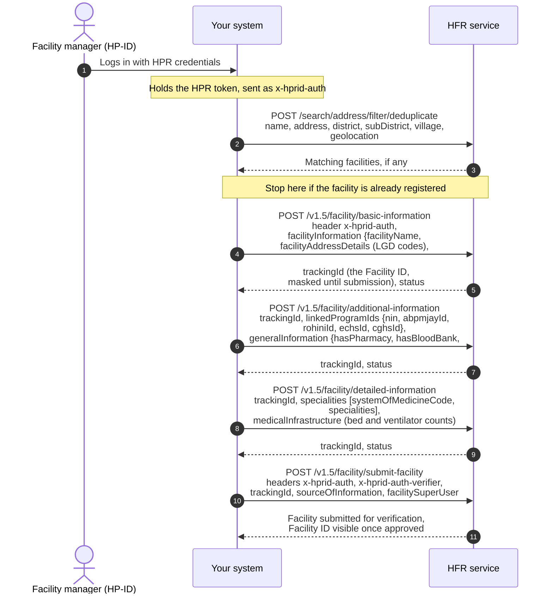
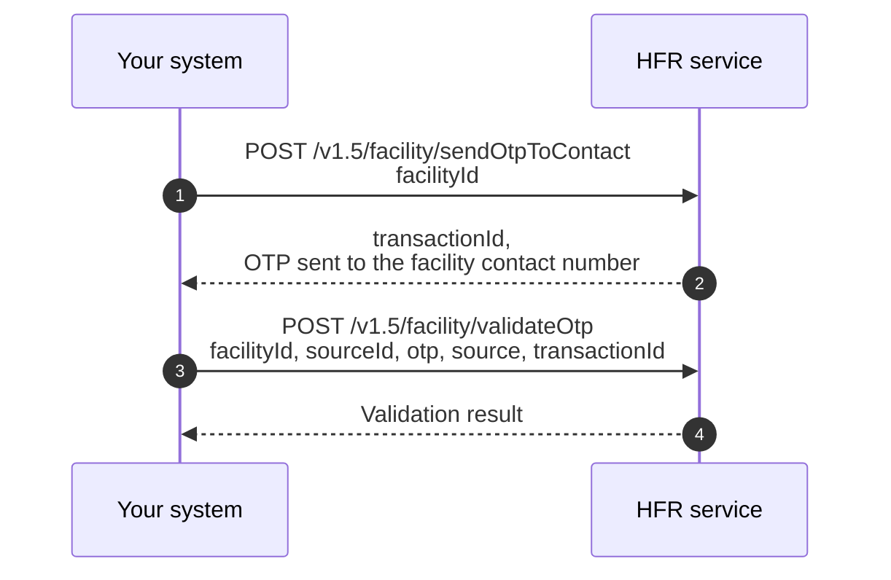

# Onboard a facility to the HFR

## In plain words

Onboarding consists of one search, three updates, and a final submission, with each update adding another layer of facility details. If you stop before submission, the facility remains in Draft status and is not visible on ABDM.

The first update captures the basic facility information and creates a Facility ID. The Facility ID is retained throughout the onboarding flow, but remains masked until the facility is fully submitted. Once submission is complete, the Facility ID becomes visible. The API returns it as `trackingId`, and that is the value every later update carries.

### What each update carries

| Call | Information captured |
|---|---|
| Basic facility information | Facility name, ownership, system of medicine, facility type and subtype, address with LGD codes, contact details, board and building photographs, and operating hours |
| Additional information | Availability of services and units such as a pharmacy, blood bank, dialysis centre, cath lab, diagnostic laboratory, or imaging centre, along with scheme identifiers such as ABPMJAY, ROHINI, ECHS, and CGHS |
| Detailed information | Specialities by system of medicine, bed and ventilator counts, and applicable sections for pharmacy, blood bank, diagnostic laboratory, and imaging services, based on the facility type |
| Submit facility | Captures the tracking ID and optional source of information, and moves the facility application out of Draft status |

The mandatory fields under detailed information vary based on the facility type, service type, and system of medicine selected during registration. Diagnostic laboratories, imaging centres, blood banks and pharmacies do not require medical infrastructure counts, such as bed or ventilator counts.

### OTP based facility verification

A shorter verification flow is available for government programmes. An OTP is sent to the contact number registered against the Facility ID, which is then validated to complete verification.

## Before you start

Someone at the facility holds an HP-ID, so you hold the HPR token that goes in `x-hprid-auth`. You hold a gateway session token and the LGD codes for the facility's address.

## What happens

Search with `/search/address/filter/deduplicate` and stop if the facility exists. Send basic information and keep the `trackingId` it returns: every later call carries it. Send additional information, then detailed information, then submit with `x-hprid-auth` and `x-hprid-auth-verifier`.

## How you know it worked

Submit accepts the same `trackingId` and reports the facility submitted for verification, and a search afterwards returns it. A facility written but never submitted stays in Draft and is invisible to ABDM, whatever the three writes returned.

## When it goes wrong

A duplicate facility: the search step is what prevents it. A field refused on detailed information, because which sections are mandatory depends on the facility type, the service type and the system of medicine rather than on the field itself.
