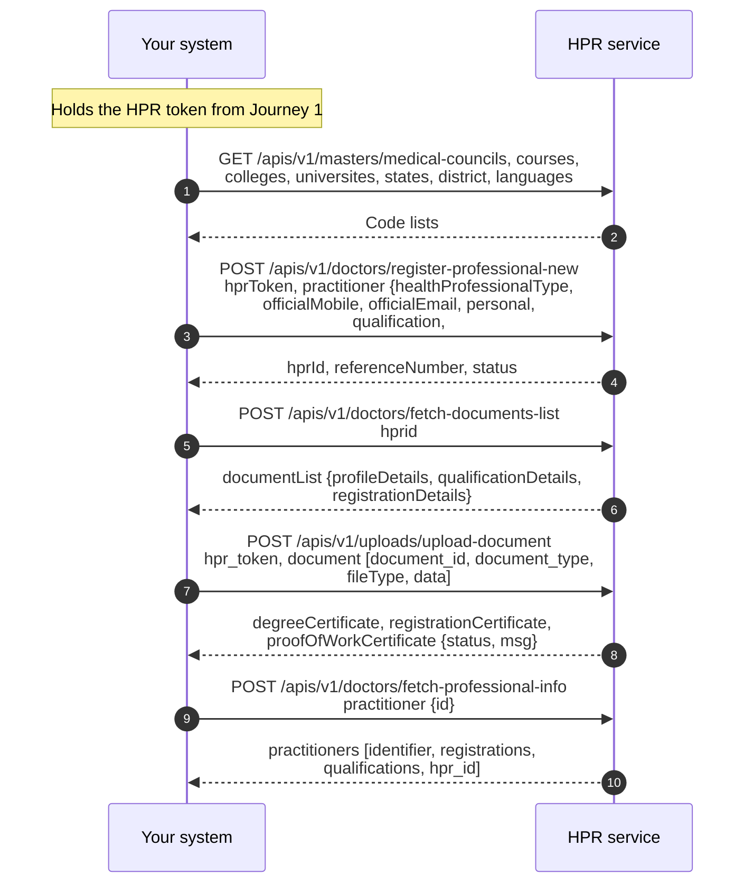

# Register a professional's profile on the HPR

## In plain words

The HP-ID is an identity, not a professional profile. The professional profile is created through the registration process, which captures details such as qualifications, council registration, and current work information. Professional registration requires the HPR Token returned from Journey 1.

The following documents are mandatory for upload: the qualification degree certificate, and the registration certificate. A proof of work certificate is mandatory for professionals working in government, or in both government and private settings.

The registration API requires codes rather than names. Therefore, the application must first fetch the relevant master data through the respective master APIs and use the corresponding codes during registration. Master data includes council, course, college, university, state, district and language.

## Before you start

The professional holds an HP-ID from Journey 1, you hold the `hprToken`, and you hold a gateway session token.

## What happens

Fetch the master lists first and send codes, never names. Call `/apis/v1/doctors/register-professional-new` with the `hprToken` in the payload. Fetch the document list, then upload one document per call to `/apis/v1/uploads/upload-document`. Corrections later go to `/apis/v1/doctors/update-professional-new`.

## How you know it worked

Registration returns the `hprId` and a status, the uploads report each certificate's status, and `/apis/v1/doctors/fetch-professional-info` shows the qualification and registration you sent. A registration with a mandatory document missing is not finished, even though the register call was accepted.

## When it goes wrong

A code that is not on the current master list reads as a validation failure on a field you believed was right: fetch the list again rather than trusting a cached value. A professional who is already registered is a state to read, not an error to retry.
