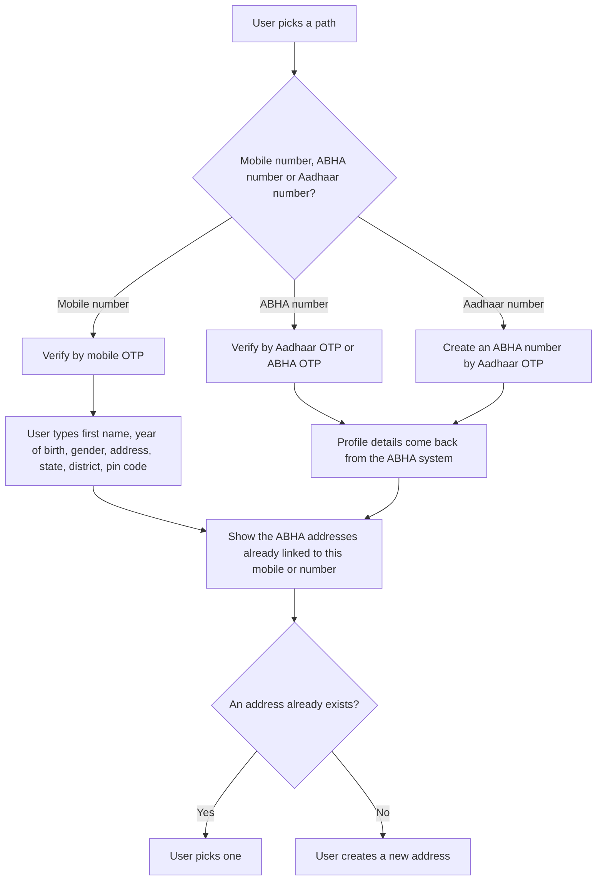

# Create an ABHA address in a PHR application

## In plain words

A person does not need an [ABHA number](/docs/hiecm/v3/getting-started/glossary#abha-number),
and does not need Aadhaar, to get an ABHA address here. A mobile number and
the OTP sent to it are enough. What that buys is a Self-Declared profile: an
address the network can route to, with no
[KYC](/docs/hiecm/v3/getting-started/glossary#kyc) behind it and no ABHA
number until the person links one later.

| Path | Validated by | Profile details | Result |
| --- | --- | --- | --- |
| Mobile number | Mobile [OTP](/docs/hiecm/v3/getting-started/glossary#otp) | The user types them | Self-Declared, no [KYC](/docs/hiecm/v3/getting-started/glossary#kyc) |
| 14 digit ABHA number | Aadhaar OTP or ABHA OTP | Returned by the ABHA system | KYC Verified |
| Aadhaar number, with no ABHA number yet | Aadhaar OTP, which creates the ABHA number first | Returned by the ABHA system | KYC Verified |

After validation on any path, show the ABHA addresses already linked to that
mobile number or ABHA number. The user then picks one instead of creating a
duplicate.

A Self-Declared profile needs a "Link ABHA number" action. The user enters the
14 digit number and validates by Aadhaar OTP or ABHA OTP. Profile details
then follow the ABHA number, and the status changes to KYC Verified.

## Before you start

A gateway session token, the PHR certificate from `GET /abha/api/v3/phr/app/login/public/certificate`, and secure storage for the refresh token, because login follows at once.

## What happens

Request the OTP at `/abha/api/v3/phr/app/enrollment/request/otp`, with scope `abha-address-enroll` and `mobile-verify` on the mobile path, and verify it at `/abha/api/v3/phr/app/enrollment/verify`. List the addresses already linked and let the person pick one. Only when there is none, offer suggestions from `/abha/api/v3/phr/app/enrollment/suggestion`, check the choice with `/abha/api/v3/phr/app/enrollment/isExists`, and create it with `/abha/api/v3/phr/app/enrollment/enrol`.

## How you know it worked

The person holds an address such as `name@abdm`, the profile shows Self-Declared or KYC Verified by the path taken, and listing the addresses on that mobile or ABHA number now returns it.

## When it goes wrong

A duplicate address, because the existing addresses were not shown first. A mandatory field missing on the mobile path, refused as validation: first name, year of birth, gender, address, state, district and pin code are the mandatory set, and day and month of birth are not in it. An expired OTP: resend unlocks after 60 seconds, so say so on the screen.
