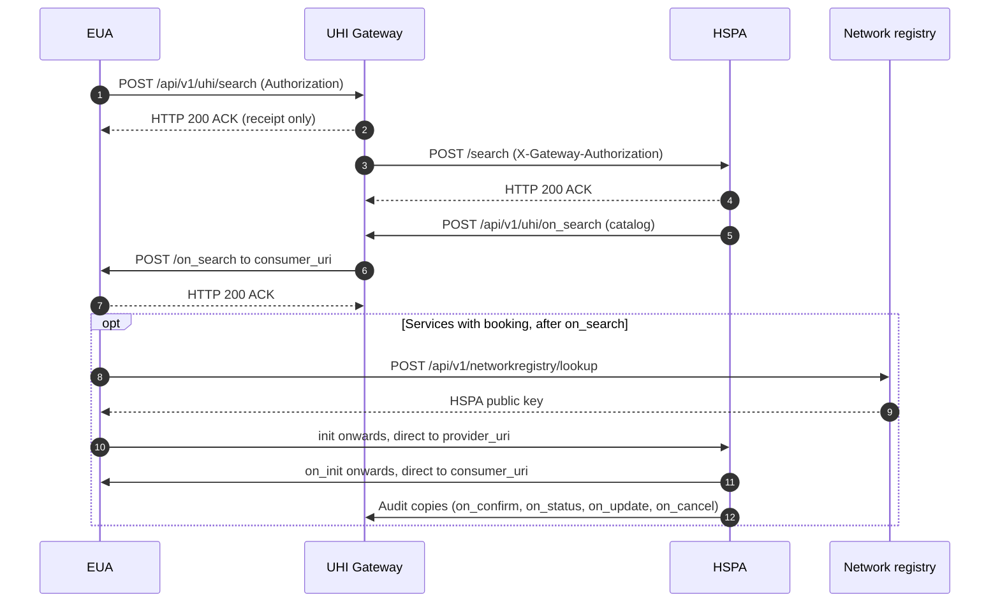

# The whole UHI exchange, from search to direct booking

## In plain words

Steps 1 to 7 apply to every service. The optional block applies to Physical Consultation, with audit copies, and to Ambulance Booking, for `init` and `on_init` only.

