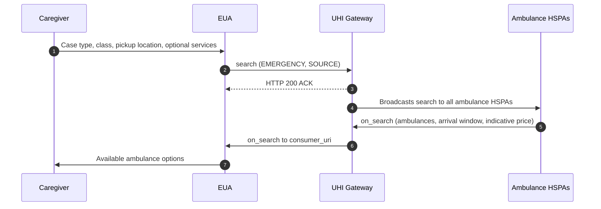

# Ambulance Booking discovery: search to on_search through the Gateway

## In plain words

The caregiver gives the case type, the class, the pickup location and any extra
services. The Gateway broadcasts the search to every ambulance HSPA. Only
providers that serve the pickup area answer.



| Case type | Location fields |
| --- | --- |
| `EMERGENCY` | `SOURCE`, with pickup GPS and address, is mandatory. `DESTINATION` is optional |

An excerpt of `on_search`, with one ambulance and its price:

```json
{
  "categories": [
    { "id": "1", "descriptor": { "code": "ALS", "name": "Advanced Life Support(ALS)" } }
  ],
  "fulfillments": [
    {
      "id": "ML-ALS-01",
      "type": "EMERGENCY",
      "tracking": true,
      "start": { "time": { "timestamp": "2026-01-05T12:30:00" } },
      "end": { "time": { "timestamp": "2026-01-05T12:35:00" } }
    }
  ],
  "items": [
    {
      "id": "1",
      "category_id": "1",
      "fulfillment_id": "ML-ALS-01",
      "descriptor": { "flag": true, "name": "Charges" },
      "price": {
        "currency": "INR",
        "value": "500",
        "estimated_Value": "500",
        "minimum_Value": "200",
        "maximum_Value": "1500"
      }
    }
  ]
}
```

Start with the first call:
[search](/docs/uhi/v1/api/ambulance/endpoints/uhi-ambulance-discovery/01-uhi-network-gateway-search).

## Before you start

The EUA has a public HTTPS `consumer_uri` and signs every call. Set `context.domain` to `nic2008:86909`, the item code to `AMBULANCE` and the fulfillment type to `EMERGENCY`.

## What happens

The EUA sends `search` to the UHI Gateway with the class, the current time as the pickup time, and the `SOURCE` GPS and address. The Gateway answers HTTP 200 ACK and broadcasts the search to every ambulance HSPA. Each HSPA that serves the pickup area returns `on_search`. It carries one fulfillment per ambulance, with its arrival window, and items priced per ambulance through `items[].fulfillment_id`.

## How you know it worked

An `on_search` reaches your `consumer_uri` with your `transaction_id` and at least one fulfillment. Store `context.provider_id` and `context.provider_uri` from it for `init`.

## When it goes wrong

No answer means no HSPA serves the pickup area, not a network fault. Skip any HSPA whose `catalog.descriptor.flag` is `true`: its service is paused. An `agent` block in any payload fails testing. Render any category code, including `PTA` and `MVA`. Agree the `on_search` wait at onboarding.
