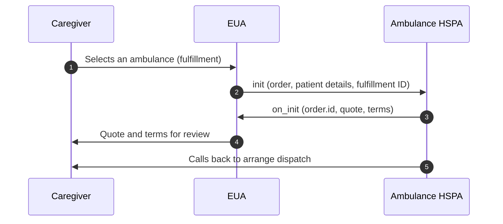

# Ambulance Booking order: init to on_init

## In plain words

The caregiver picks an ambulance. The EUA sends the patient's details directly
to that HSPA, which returns a quote and terms. The provider then calls the
caregiver to arrange dispatch.

Start with the first call:
[init](/docs/uhi/v1/api/ambulance/endpoints/uhi-ambulance-order/01-uhi-ambulance-init).

## Before you start

Hold `context.provider_id`, `context.provider_uri`, the chosen item id and fulfillment id from `on_search`, and the patient's ABHA address. `init` goes directly to the HSPA, signed, after looking up its public key.

## What happens

The EUA sends `init` with `order.provider.id`, `order.item.id` and `order.item.fulfillment_id`, and a matching `order.fulfillment.id`. It adds billing, `order.customer.id` as the ABHA address, and the `SOURCE` location. The HSPA returns `on_init` with `order.id`, `order.quote.price.value` and its `order.quote.breakup[]`. It also returns the payment type and status, five terms as `INITIATED`, and `order.fulfillment.tags.terms_reference`.

## How you know it worked

`on_init` reaches your `consumer_uri` with an `order.id`, a quote and all five terms. Show the cancellation and payment terms before any confirm action. The HSPA then calls the caregiver to arrange dispatch.

## When it goes wrong

`on_init` is a quote, not a booking: there is no `confirm`, `status` or `cancel` in this service today. Send the item and fulfillment ids exactly as `on_search` gave them. Driver and vehicle details in any payload fail testing.
