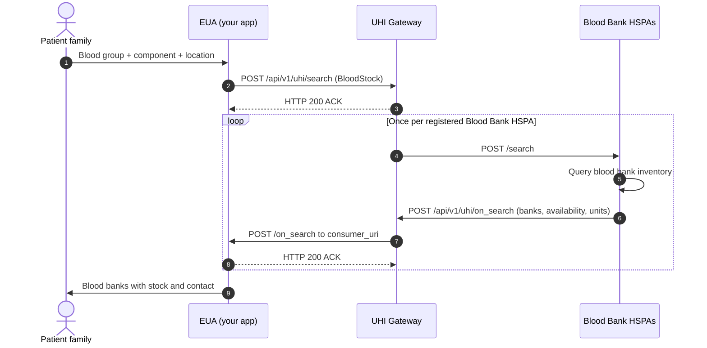

# Blood Bank discovery: search to on_search from every Blood Bank HSPA

## In plain words

A patient's family searches for blood of a given group and component.

Steps 4 to 8 happen once per registered Blood Bank HSPA. Aggregate results by `transaction_id` as they arrive, and close the window after 10 to 15 seconds.

The first call in the reference is [search](/docs/uhi/v1/api/network/endpoints/uhi-blood-bank/01-uhi-network-gateway-search).

## Before you start

The EUA has a public HTTPS `consumer_uri` and signs every call. Set `nic2008:86906` and `BloodStock`. Send the blood group in `item.descriptor`, the component in `category.descriptor`, and one location mode.

## What happens

The EUA sends `POST /api/v1/uhi/search`, and the Gateway answers HTTP 200 ACK. The Gateway forwards the search to every registered Blood Bank HSPA. Each HSPA answers with its own `on_search` on your `consumer_uri`. Answer each with HTTP 200 ACK and aggregate them by `transaction_id`.

## How you know it worked

At least one `on_search` arrives with your `transaction_id`. Each blood group item carries `quantity.count` and a `fulfillment_id` that points to its availability.

## When it goes wrong

A wrong `domain` means no HSPA responds. No end signal arrives, so close the window after 10 to 15 seconds. The unavailable status arrives as `NotAvailable` or `Not Available`, so match both. Counts are indicative: show the phone number and a call to confirm.
