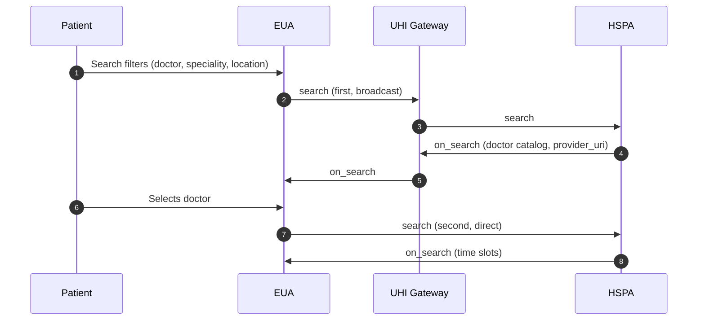

# Physical Consultation discovery: broadcast search, then slots from the HSPA

## In plain words

The patient searches by doctor, speciality or location. The Gateway broadcasts
the first search to every HSPA in the domain, and each matching HSPA answers
with its own catalog. The EUA then asks the chosen HSPA directly for the
doctor's slots.

The first search filters are all optional, on top of the service identity and
the time window.

| Filter | Field |
| --- | --- |
| Doctor name | `fulfillment.agent.name` |
| HPR ID | `fulfillment.agent.id` |
| Speciality | `category.descriptor` |
| State | `location.state` |
| District | `location.district` |
| City | `location.city` |
| Pincode | `address.area_code` |
| Facility name | `provider.descriptor.name` |
| GPS with radius | `location.gps` and `location.radius` |

A GPS search needs all three radius fields: `type: CONSTANT`, `value`, and
`unit: km`. If one is missing, the filter is ignored without an error.

Start with the first call:
[search](/docs/uhi/v1/api/consultation/endpoints/uhi-consultation-discovery/01-uhi-network-gateway-search).

## Before you start

The EUA has a public HTTPS `consumer_uri`, signs every call, and uses a fresh `transaction_id` per search. Set `context.domain` to `nic2004:85111` and the fulfillment type to `Physical`, which is case sensitive.

## What happens

The first `search` goes to the UHI Gateway, which broadcasts it. Each matching HSPA returns its own `on_search` catalog of doctors, so group the replies by `transaction_id`. Store `context.provider_uri` and `provider_id` from the chosen catalog. Look up that HSPA's public key at `/api/v1/networkregistry/lookup`, then send the second `search` straight to it. Its `on_search` returns the doctor's slots.

## How you know it worked

The second `on_search` reaches your `consumer_uri` with the same `transaction_id` and at least one slot. Keep the slot's `fulfillments[].id`: it becomes the fulfillment id in `init`.

## When it goes wrong

A GPS filter missing any of its three radius fields is ignored without an error, so results come back unfiltered. No `on_search` timeout is set for this service: render results as they arrive and agree a timeout at onboarding. Handle an empty `on_search` as a normal outcome. Do not call `select`: go from the second `on_search` to `init`.
