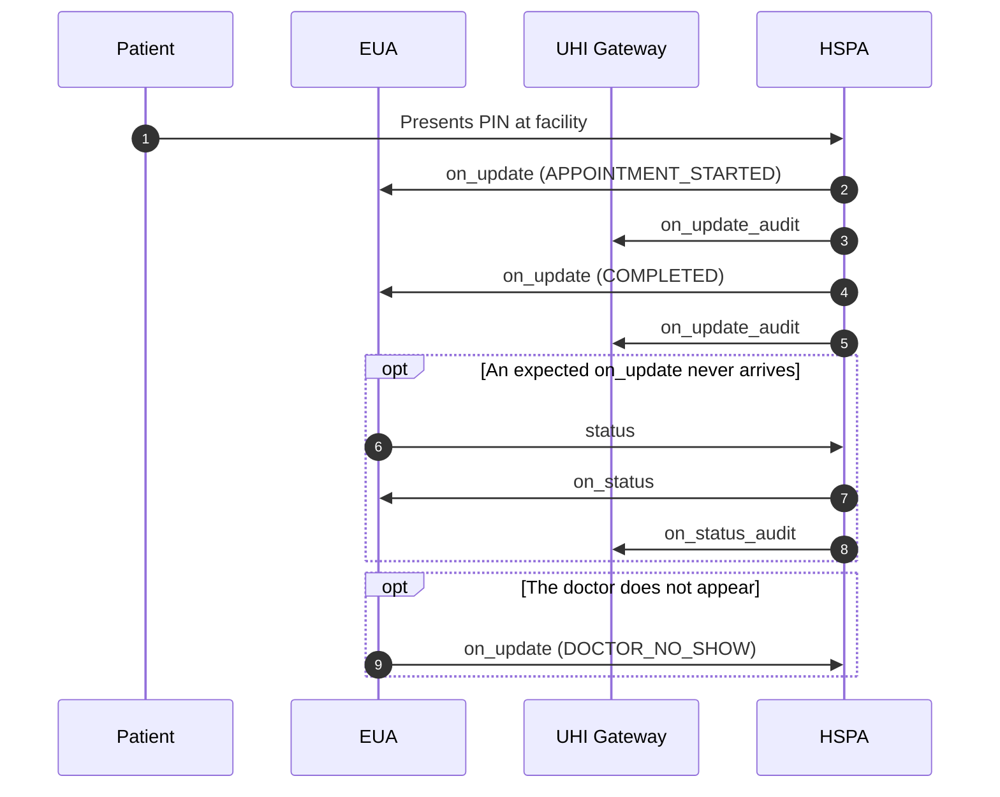
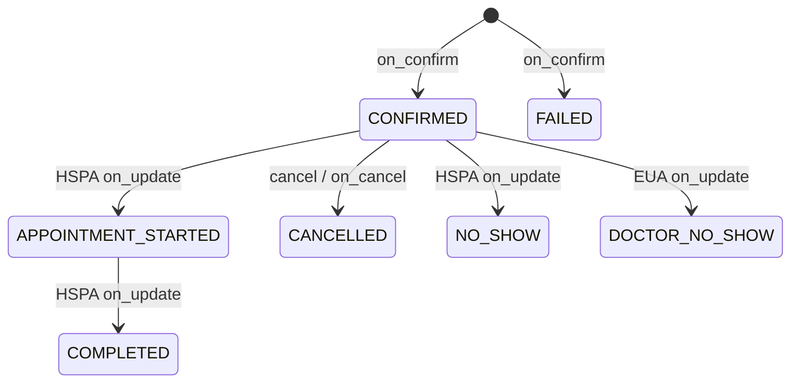

# Physical Consultation fulfilment: PIN check-in, on_update and status

## In plain words

The patient shows the PIN at the facility. The HSPA pushes each state change to
the EUA with `on_update`. The EUA calls `status` only when an expected update
never arrives.

The appointment moves through these states. Only `DOCTOR_NO_SHOW` starts from
the EUA. Every other state change comes from the HSPA.

Start with the first call:
[status](/docs/uhi/v1/api/consultation/endpoints/uhi-consultation-fulfilment/01-uhi-consultation-status).

## Before you start

The order is `CONFIRMED` and you hold its `order.id`. The EUA exposes `/on_update` and `/on_status`. The HSPA exposes `/status` and `/on_update`.

## What happens

At check-in the PIN status moves from `GENERATED` to `VERIFIED`, or to `HSPAOVERRIDE` with an override reason code. The HSPA pushes `on_update` for `APPOINTMENT_STARTED`, then `COMPLETED`, or for `NO_SHOW`. It copies each one to `on_update_audit`. The EUA sends `status` only when an expected update never arrives, and the HSPA copies its `on_status` to `on_status_audit`.

## How you know it worked

An `on_update` with `COMPLETED` reaches the EUA, carrying `@abdm/gov.in/care_context_id`. Keep that id. With the doctor's `@abdm/gov.in/hip_id`, it lets the EUA fetch the records later.

## When it goes wrong

If no `on_update` arrives when expected, call `status`. The EUA sets one state only, `DOCTOR_NO_SHOW`, through `on_update`. Do not send or depend on `NOT_VERIFIED`. An HSPA sends every `on_update_audit`, because it is the copy that counts for DHIS.
