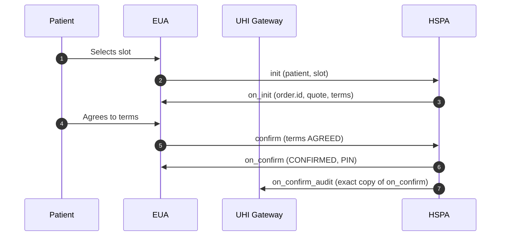

# Physical Consultation order: init to on_confirm

## In plain words

The EUA sends the patient and the slot. The HSPA holds the slot, assigns the
order id and returns the quote and five terms. Once the patient agrees, the HSPA
confirms and issues the PIN.



An excerpt of a confirmed `on_confirm`:

```json
{
  "order": {
    "id": "3714-330853-9384",
    "state": "CONFIRMED",
    "fulfillment": {
      "id": "79db6b5b-afe4-4297-b9b1-5148ed45372c",
      "type": "Physical",
      "tags": {
        "@abdm/gov.in/slot_id": "79db6b5b-afe4-4297-b9b1-5148ed45372c",
        "@abdm/gov.in/messaging_support": "true",
        "@abdm/gov.in/helpline_number": ""
      }
    },
    "authorization": {
      "type": "PIN",
      "token": "3774",
      "valid_from": "2026-06-18T00:00:00",
      "valid_to": "2026-06-18T23:59:00",
      "status": "GENERATED"
    }
  }
}
```

Start with the first call:
[init](/docs/uhi/v1/api/consultation/endpoints/uhi-consultation-order/01-uhi-consultation-init).

## Before you start

Hold the chosen HSPA's `provider_uri` and `provider_id`, and the slot's `fulfillments[].id`, from the second `on_search`. Every call from here goes directly to the HSPA, signed, after looking up its public key.

## What happens

The EUA sends `init` with the patient and the slot UUID as the fulfillment id, also in `@abdm/gov.in/slot_id`. The HSPA holds the slot for 15 minutes and returns `on_init` with `order.id`, the quote and five terms as `INITIATED`. Show all five. Send `confirm` with the HSPA's `order.id` and the terms unchanged, except `termsState` set to `AGREED`. The HSPA returns `on_confirm` and sends an exact copy to `on_confirm_audit`.

## How you know it worked

`on_confirm` arrives with state `CONFIRMED` and `authorization.type: PIN`, a 4-digit token with status `GENERATED`. Show the PIN to the patient and keep it in memory only.

## When it goes wrong

A slot UUID that does not match `on_search` makes the HSPA reject the request or fail to hold the slot. One term left as `INITIATED` in `confirm` causes rejection. Use the `order.id` from `on_init` in `confirm` and every call after it. `FAILED` in `on_confirm` means the booking did not complete. Never write the PIN to a database or a log.
