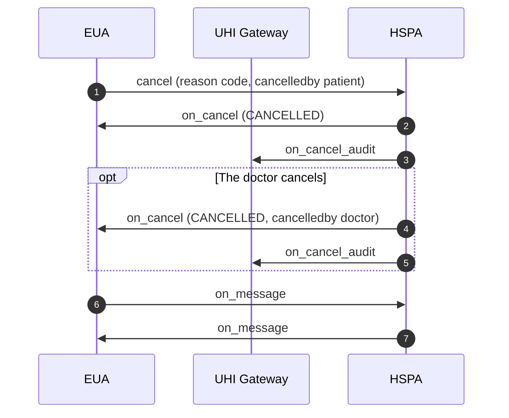

# Physical Consultation post-fulfilment: cancel, on_cancel and on_message

## In plain words

A cancellation takes the place of fulfilment. The patient cancels through the
EUA, or the doctor cancels through the HSPA. Either side sends the other a
message with `on_message`.

Start with the first call:
[cancel](/docs/uhi/v1/api/consultation/endpoints/uhi-consultation-post-fulfilment/01-uhi-consultation-cancel).

## Before you start

Hold the order's `order.id`. Pick the reason code from the lists under Cancellation and override reason codes, and send it exactly as listed.

## What happens

A patient cancellation is a `cancel` from the EUA with `@abdm/gov.in/cancelledby: patient` and the reason in `@abdm/gov.in/cancel_reason`. The HSPA answers `on_cancel` with `CANCELLED` and copies it to `on_cancel_audit`. A doctor cancellation is an `on_cancel` the HSPA sends unprompted, with `@abdm/gov.in/cancelledby: doctor`. Either side can send `on_message`.

## How you know it worked

An `on_cancel` with `CANCELLED` reaches the EUA, and the HSPA has sent its copy to `on_cancel_audit`.

## When it goes wrong

`@abdm/gov.in/cancelledby` is mandatory, because it decides which terms apply. `PATIENT_OTHER` and `DOCTOR_OTHER` need free text. `/on_message` is mandatory for an EUA and optional for an HSPA.
