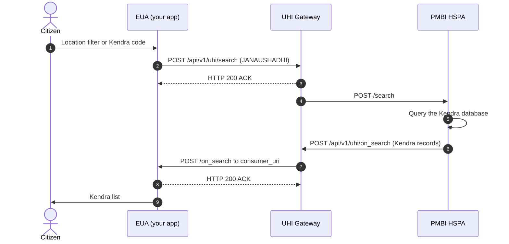

# Jan Aushadhi: find a Kendra

## In plain words

A citizen searches for Jan Aushadhi Kendras.

The first call in the reference is [search](/docs/uhi/v1/api/network/endpoints/uhi-jan-aushadhi-kendra-search/01-uhi-network-gateway-search).

## Before you start

The EUA has a public HTTPS `consumer_uri` and signs every call. Set `nic2008:47721`, and `JANAUSHADHI` as both the fulfillment type and the item code and name. Every location filter is optional.

## What happens

The EUA sends `POST /api/v1/uhi/search` with a location filter, or with a Kendra code in `category.descriptor.code` and `.name`. The Gateway answers HTTP 200 ACK and forwards it to `pmbi.hspa`. Its `on_search` reaches your `consumer_uri` through the Gateway.

## How you know it worked

An `on_search` arrives with your `transaction_id`. Each `providers[]` record is one Kendra, and its `id` is the Kendra code.

## When it goes wrong

A wrong `fulfillment.type` returns the wrong kind of catalog, or nothing. Empty city, email, `short_desc` or `long_desc` are not errors. Display an unrecognised ownership code as sent. Check the HSPA's signature with key ID `pmbi.hspapid.jak`.
