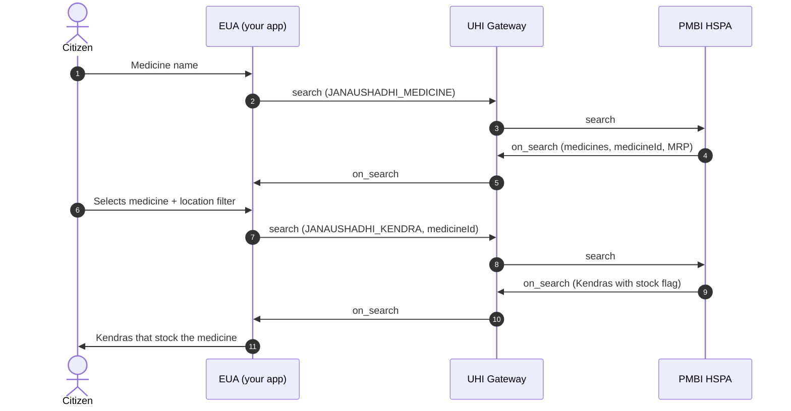

# Jan Aushadhi: find a medicine, then the Kendras that stock it

## In plain words

A citizen looks up a generic medicine by name, then searches for Kendras that stock it. Gateway ACKs are left out of this diagram.

The two searches are separate transactions. Only `medicineId` carries across from step 5 to step 7.

The first call of each search in the reference: [medicine search](/docs/uhi/v1/api/network/endpoints/uhi-jan-aushadhi-medicine-search/01-uhi-network-gateway-search) and [Kendras for a selected medicine](/docs/uhi/v1/api/network/endpoints/uhi-jan-aushadhi-medicine-stock/01-uhi-network-gateway-search).

## Before you start

The EUA has a public HTTPS `consumer_uri` and signs every call, with `context.domain` set to `nic2008:47721`. The citizen has typed a medicine name.

## What happens

The first search uses `JANAUSHADHI_MEDICINE`, with the name in `item.descriptor.name` and the name without spaces in `item.descriptor.code`. Its `on_search` lists medicines, and each `providers[].id` is a `medicineId`. After the citizen picks one, the second search uses a new `transaction_id` and `JANAUSHADHI_KENDRA`. It carries the `medicineId` in `item.descriptor.code` and `.name`, plus any location filter.

## How you know it worked

The second `on_search` lists Kendras. Each carries the medicine in `items[]`, where `descriptor.flag` is `true` for in stock and `false` for out of stock.

## When it goes wrong

Never send a medicine name in the second search. Name matching is not fixed, so show every medicine returned and let the citizen choose. Render stock from `descriptor.flag`, and show a count from `quantity.measure.value` only when one arrives. `location.radius` carries a distance only when the search sent GPS.
