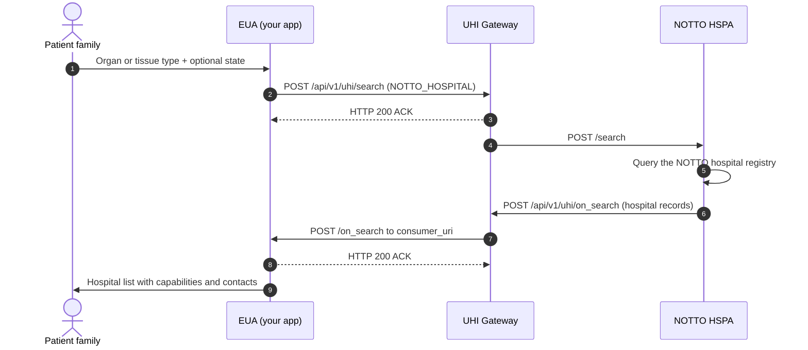

# NOTTO discovery: search to on_search

## In plain words

A patient's family searches for NOTTO registered hospitals for an organ or tissue type.

If step 7 does not arrive within your timeout, check that `consumer_uri` is publicly reachable and that `transaction_id` matches.

The first call in the reference is [search](/docs/uhi/v1/api/network/endpoints/uhi-notto/01-uhi-network-gateway-search).

## Before you start

The EUA has a public HTTPS `consumer_uri` and signs every call. Set `nic2004:86100`, `NOTTO_HOSPITAL` and `NOTTO`. Send an organ or tissue code from the master list. State is optional, and district needs state.

## What happens

The EUA sends `POST /api/v1/uhi/search`, and the Gateway answers HTTP 200 ACK. The Gateway forwards it to `notto.hspa`, which queries the NOTTO hospital registry. Its `on_search` reaches your `consumer_uri` through the Gateway. Answer it with HTTP 200 ACK.

## How you know it worked

An `on_search` arrives with your `transaction_id`. Each hospital carries the four capability tags and the transplant coordinator's `contact.phone`.

## When it goes wrong

If no `on_search` arrives within your timeout, check that `consumer_uri` is publicly reachable and that `transaction_id` matches. An unknown organ or tissue code returns an error. GPS and radius search is not available yet. Store `providers[].id` as a string. Read the Gateway signature from `X-Gateway-Authorization`, and accept `Proxy-Authorization` as well.
