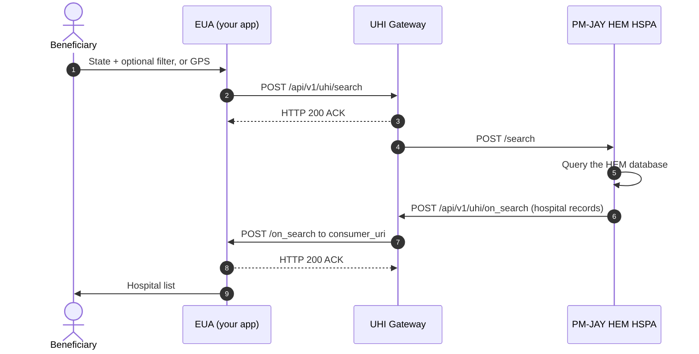

# PM-JAY HEM discovery: search to on_search

## In plain words

A beneficiary searches for PM-JAY empanelled hospitals.

The optional filter is one of district, speciality, facility name or pincode. If step 7 does not arrive within your timeout, stop waiting and offer a retry. If the catalog is empty, suggest a wider search.

The first call in the reference is [search](/docs/uhi/v1/api/network/endpoints/uhi-pmjay-hem/01-uhi-network-gateway-search).

## Before you start

The EUA has a public HTTPS `consumer_uri`, a subscriber ID, and signs every call. Set `nic2004:85112`, `PMJAYHEM` and `PMJAY` exactly. Send a state, or GPS with all three radius fields.

## What happens

The EUA sends `POST /api/v1/uhi/search`, and the Gateway answers HTTP 200 ACK. The Gateway forwards the search to the single PM-JAY HEM HSPA, which queries the HEM database. Its `on_search` reaches your `consumer_uri` through the Gateway. Answer it with HTTP 200 ACK. Expect one `on_search` per search.

## How you know it worked

An `on_search` arrives with your `transaction_id`, and each record in `catalog.providers[]` is one empanelled hospital.

## When it goes wrong

A wrong case in `PMJAYHEM` or `PMJAY` means no HSPA responds. If no `on_search` arrives within your timeout, stop waiting and offer a retry. If the catalog is empty, suggest a wider search. GPS search can miss hospitals, so offer district or pincode next to it.
