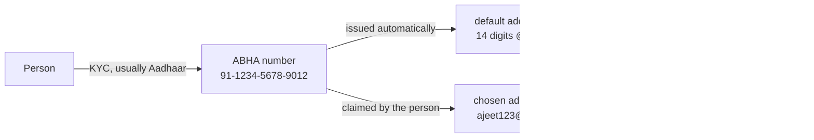

# ABHA number and ABHA address, and why there are two

## In plain words

A person in ABDM has two identifiers and they do different jobs.

The [ABHA number](../../shared/glossary/abha-number.md) is fourteen
digits. It is issued after a KYC check and it answers "who is this
person". It is the trustworthy one, because Aadhaar stood behind it.

The [ABHA address](../../shared/glossary/abha-address.md) looks like
`ajeet123@abdm`. It answers "where do this person's records get routed".
It is the one a person types at a facility, and the one care contexts are
linked against.

## Before you start

Nothing. This is the first thing to read in M1.

## What happens

Every ABHA number automatically gets one address, formed from the digits
and the environment suffix. Most people then claim a memorable one.

One number can carry more than one address, and one mobile number can
carry several ABHA accounts, which is common in a family. That is why
logging in sometimes returns a list of accounts to choose from rather
than a token.

The address policy: at least four characters, letters, numbers and dots,
never starting with a digit, never starting or ending with a dot.

## How you know it worked

You have understood this when you can answer both of these.

  1. A patient gives you `ajeet123@sbx`. Is that enough to create their
     ABHA, or only enough to route to an existing one?
  2. Your integration stores one identifier per patient. Which one should
     it be, and what breaks if you chose the other?

## When it goes wrong

The failure that costs a day: storing the address as the primary key. A
person can hold several addresses and can add more later, so the number
is the stable identity and the address is the routing handle.

The second failure is the environment suffix. An `@sbx` address does not
exist in production, and the error reads as not found rather than as a
wrong environment.

