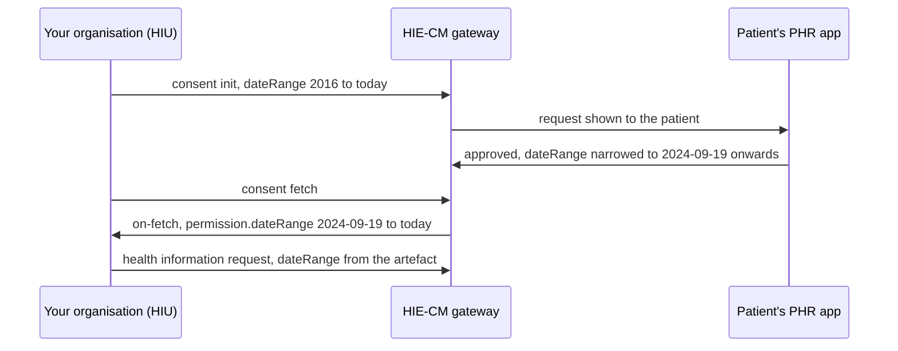

# Build the data request from the artefact, not from your request

## In plain words

When you raise a consent request you name a date range. When the
patient approves it in their app, they can change that range, and the
artefact records what they granted, not what you asked. A health
information request for the range you asked is a request for records
the patient did not grant, and the gateway refuses it with
[ABDM-1063](hiecm.error.abdm-1063).

## Before you start

- A granted consent, with the artefact fetched. See [fetch the records a consent covers](hiecm.flow.m3-fetch-records).

## What happens

The artefact arrives on [the on-fetch callback](hiecm.callback.m3-on-consent-fetch)
as `consent.consentDetail.permission.dateRange`. Copy `from` and `to`
from there into `hiRequest.dateRange` on the
[health information request](hiecm.endpoint.m3-hiu-health-information-request).
Never copy them from the init request you sent, and never widen them.
The same applies to `hiTypes` and `careContexts`: the artefact is the
grant.

While you are building that request, two more rules from the same
exchange:

- Put the consent id in the `dataPushUrl` path. The push can arrive in
  the same second as the on-request acknowledgement, before a lookup by
  `transactionId` has anything to find.
- Store the private half of your key pair against the consent id and
  keep it until the push has decrypted, so a restart between request
  and push does not lose the records.

## How you know it worked

You have understood this when you can answer both of these.

1. You asked for 2016 to today and the artefact says 2024-09-19 to
   today. What goes in the health information request?
2. Your request is refused with ABDM-1063 and you never changed the
   range. Who did?

## When it goes wrong

Caching the range from init and skipping the fetch. Every request for
a narrowed consent fails with ABDM-1063 and nothing in your logs
explains why.

Widening the range "to be safe". Same refusal.

Keying the push route on a transaction id stored from on-request. The
push races the acknowledgement and lands on a route that does not know
it yet.
