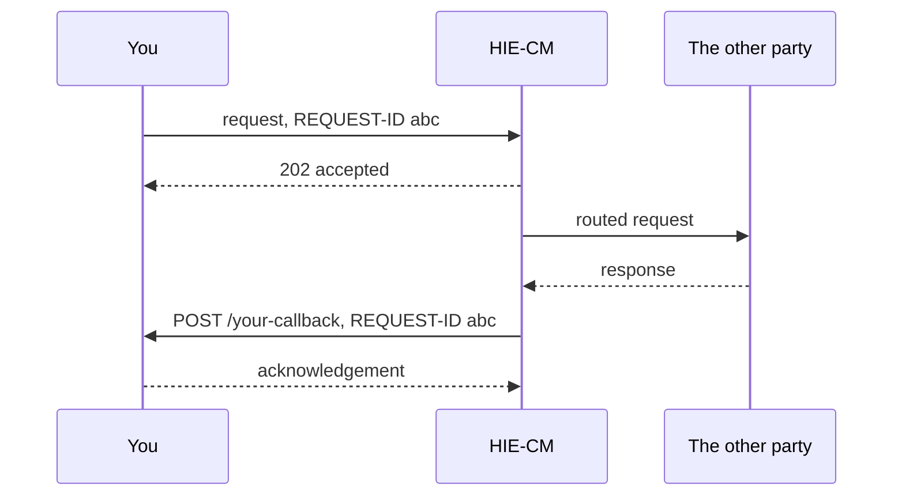

# Asynchronous calls and callbacks, why a 200 means very little

## In plain words

In M1 you call and get your answer. In M2 and M3 you usually call, get an
acknowledgement, and the real answer arrives afterwards as a POST from
ABDM to a URL you registered.

So a 200 means your request was accepted and well formed. It does not
mean the work happened.

## Before you start

You need a publicly reachable callback URL registered with ABDM. See
[the callback URL](../../shared/sandbox/callback-url.md).

## What happens

The `REQUEST-ID` you generated comes back on the callback. That is the
only reliable way to match a reply to the call that caused it, because
callbacks do not arrive in the order you sent the requests.

In this catalogue these callbacks are described as OpenAPI 3.1
`webhooks` inside the module spec that owns them. See
[callbacks as webhooks](../decisions/callbacks-as-webhooks.md).

## How you know it worked

You have understood this when you can answer both of these.

  1. You send three requests and two callbacks arrive. Which request is
     still outstanding, and how do you know?
  2. The same callback arrives twice. What must your handler do?

## When it goes wrong

It never arrives. Check the callback URL first: not public, not registered, or not
responding fast enough. See [the callback never arrives](../troubleshooting/callback-never-arrives.md)
for the checks in the order this catalogue recommends, not a record of how often each has been
the actual cause.

Treating retries as new events. A duplicate delivery must be safe, which
means keying on the `REQUEST-ID` rather than appending on every POST.

Waiting on the response body instead of the callback, which produces an
integration that appears to work in testing and hangs in production.

