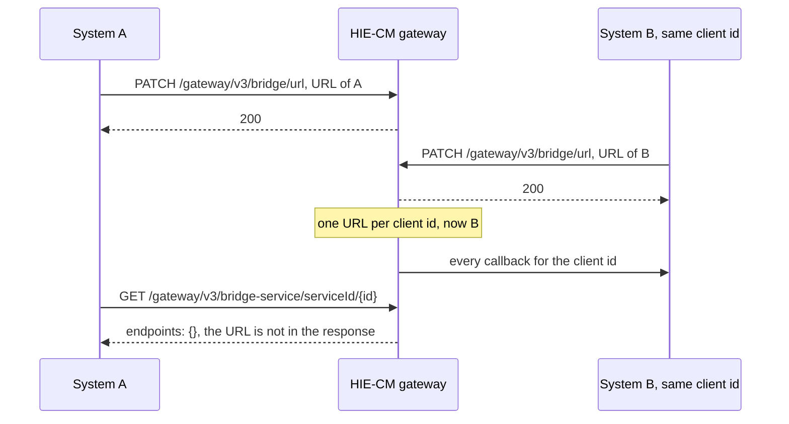

# Who owns the bridge URL, and proving a change took

## In plain words

Your [bridge](shared.glossary.bridge) URL is where ABDM posts every
callback. The gateway stores exactly one URL per client id. Whoever
patches it last owns every callback from that moment, and there is no
call that tells you which URL is registered now.

Two things follow. A client id shared between two systems, such as a
team's sandbox id used by a developer laptop and a staging server, sends
all callbacks to whichever system registered last, silently. And a
tunnel that changes address on restart needs the URL re-registered and
proven after every restart.

## Before you start

- A client id and secret. See [registration and credentials](shared.sandbox.registration-and-credentials).
- A public URL for your bridge. See [the callback URL](shared.sandbox.callback-url).

## What happens

[Update bridge URL](hiecm.endpoint.gateway-update-bridge-url) replaces
the URL for the whole client id. [Get bridge service by id](hiecm.endpoint.gateway-get-bridge-service-by-id)
confirms the client is active as HIP, HIU or PHR, and returns
`"endpoints": {}`, so it cannot confirm the URL.

The only proof is delivery. After any change to the URL, run one cheap
round trip before doing anything else:

- As a HIP: link a test care context and wait for
  [the link result](hiecm.callback.m2-on-carecontext-result). It arrives
  within about a second when the URL is right.
- As a HIU: send a consent init and wait for
  [the on-init callback](hiecm.callback.m3-on-consent-request-init).

If the round trip does not complete, no other callback will either.
Stop and fix the URL before reading any other symptom.

Keep the administrative routes of your own service, including whatever
sets the bridge URL, unreachable through the tunnel. Refuse requests
that arrive with `X-Forwarded-For` or from a non loopback address.

## How you know it worked

You have understood this when you can answer both of these.

1. Callbacks that worked yesterday have stopped, and the gateway returns
   200 on every call you make. What did somebody else do, and what one
   call tells you?
2. You restarted your tunnel. What two things happen before you retry
   the flow that was failing?

## When it goes wrong

Callbacks stop for hours and every outbound call still succeeds. Another
system with your client id patched the URL. Re-register and run the
round trip.

You look for a read endpoint to confirm the URL and find
`endpoints: {}`. There is none. Delivery is the check.

A scan and share scan produces nothing on your bridge. Same cause, same
fix. See [scan and share](hiecm.concept.scan-and-share).
