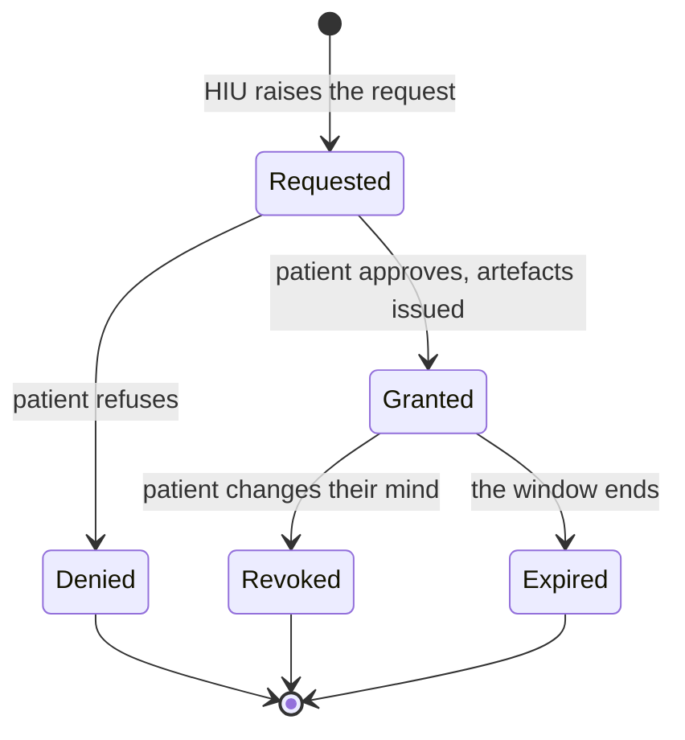

# Consent, what it authorises and how it ends

## In plain words

Nothing in ABDM lets one party read another's records by asking nicely.
An [HIU](../../shared/glossary/hiu.md) raises a consent request against
the patient's ABHA address. The patient grants or denies it. If granted,
the consent manager issues
[consent artefacts](../../shared/glossary/consent-artefact.md) and the
HIU fetches against those.

## Before you start

You need a gateway session, and you are acting as an HIU here, because
requesting consent is what reading looks like. Read
[roles](roles.md) if that distinction is new.

## What happens

A consent request names four things: whose records, what types, for which
date range, and for what purpose. NHA's purpose codes are a subset of the
HL7 PurposeOfUse value set, and include care management, break the glass,
public health, healthcare payment, disease specific research and self
requested.

Granted is not permanent. Revoked and Expired are ordinary destinations,
not faults, and your system will meet them in production.

## How you know it worked

You have understood this when you can answer both of these.

  1. A consent was granted last week for a three month window. What are
     the two different reasons a fetch today might legitimately fail?
  2. Who decides the expiry, you or the patient?

## When it goes wrong

Designing as though granted meant permanent. A fetch that worked
yesterday can fail today because the patient revoked, and that is the
system working correctly.

Caching fetched records past the consent window is the version of this
mistake that has legal consequences rather than technical ones.

