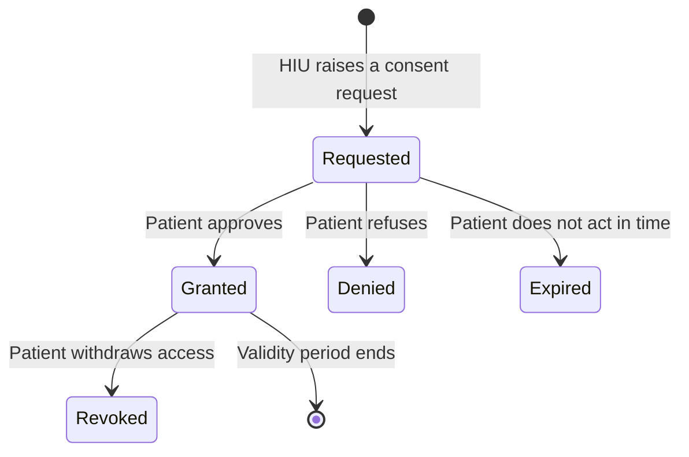

# Consent, what it authorises and how it ends

## In plain words

There are five states, in the two sections a PHR app shows: Requests holds Requested, Denied and Expired; Approved holds Granted and Revoked.

```mermaid
stateDiagram-v2
    [*] --> Requested: HIU raises a consent request
    Requested --> Granted: Patient approves
    Requested --> Denied: Patient refuses
    Requested --> Expired: Patient does not act in time
    Granted --> Revoked: Patient withdraws access
    Granted --> [*]: Validity period ends
```

| State | What it means | What your system does |
| --- | --- | --- |
| Requested | The patient has not acted yet. | Wait. Poll the request status if you need to show progress. |
| Granted | The patient approved, and set how long the access lasts. | Fetch the artefact ids, then request the data. |
| Denied | The patient refused. | Stop. There is no partial result and no retry that changes the answer. |
| Expired | The patient did not act inside the window the HIU set on the request. | Raise a new request if the clinical need is still there. |
| Revoked | The patient withdrew a consent they had already granted. | Stop fetching under that artefact from that moment. |

Two clocks run here. The **request window** is how long the patient has to answer, set by the HIU, and running out produces Expired. The **consent validity period** is how long access lasts once granted, set by the patient as they grant, with a defined expiry date and time. Neither is the **date range**, which says which records are in scope by when the care happened: a consent granted today can cover records from 2019.

Granted is not permanent. Revoked and Expired are ordinary destinations, not faults, and your system will meet both in production.

## Before you start

A gateway session, and your system acting as the HIU for this request. A consent request names four things: whose records, which HI types, which date range, and the purpose code.

## What happens

Store the consent request id from the init callback, then every consent artefact id a grant returns. Before each fetch, check the artefact is still usable: the patient can revoke at any time, and the validity period ends on its own.

## How you know it worked

A granted request returns at least one artefact id, and a fetch under it is accepted while the artefact is within its validity period and not revoked.

## When it goes wrong

A fetch that worked last week fails today because the patient revoked or the validity period ended; that is the system working. `ABDM-1062` is consent not granted, and `ABDM-1112` is an artefact id that is invalid or already expired. Records kept past the consent window are a legal problem, not a technical one.
