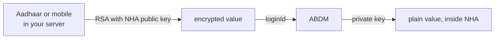

# Why identifiers are encrypted, and where to do it

## In plain words

Across M1, the value you put in `loginId` is not the raw Aadhaar,
ABHA or mobile number. It is that value encrypted against NHA's public
key.

The same applies to OTP values on several calls.

What you encrypt has a shape, and the service checks it after it
decrypts. An ABHA number is `NN-NNNN-NNNN-NNNN`, dashes included, for
example `91-1234-5678-9015`. An Aadhaar number is 12 digits with no
spaces. A mobile number is 10 digits with no country code. Encrypting an
ABHA number as 14 bare digits is rejected: a login OTP request sent that
way on the sandbox on 2026-09-11 returned
`400 {"loginId": "LoginId is invalid"}`, and the same number with its
dashes passed validation and went on to look the account up.

## Before you start

You need the certificate, which carries both the public key and the
algorithm to use it with. Fetch it from
[the certificate endpoint](../endpoints/m1-get-public-certificate.md).
Read [the gateway session](gateway-session.md) first, since that call
needs a token like any other.

More than one certificate is published, and they are not
interchangeable. The profile certificate is 4096-bit. The PHR login
certificate at
[its own endpoint](../endpoints/p1-get-certificate-public-key.md) is
2048-bit. Both name the same algorithm. Encrypting under the wrong one
is refused by the field validator, which names the business field and
never mentions the key.

## What happens

The model is straightforward: NHA publishes a public key, you encrypt
locally, only NHA can decrypt.



NHA's collection also contains a hosted helper that encrypts a value for
you, and two third party encryption websites. Those are conveniences for
trying a flow by hand.

### The padding comes with the key

The certificate response carries the algorithm next to the key:

```response
{
  "publicKey": "<base64 DER>",
  "encryptionAlgorithm": "RSA/ECB/OAEPWithSHA-1AndMGF1Padding"
}
```

Read `encryptionAlgorithm` and encrypt with what it names. It is a Java
transformation string, so translate it for your language rather than
assuming: `RSA/ECB/OAEPWithSHA-1AndMGF1Padding` means RSA-OAEP with
SHA-1 for both the digest and the mask generation function, which in
Node is
`crypto.publicEncrypt({ key, padding: crypto.constants.RSA_PKCS1_OAEP_PADDING, oaepHash: 'sha1' }, ...)`.
Send the result base64 encoded.

Hard coding the padding works until the field changes, and then fails
in a way that looks like a bad value rather than a stale constant. Code
that reads the field survives a rotation. Code that cannot recognise
what the field names should refuse to encrypt rather than fall back to
a default.

PKCS#1 v1.5 is refused today, and so is OAEP with SHA-256. Neither
refusal names encryption. The call for each language, and the padding
the older API families take, is in
[encrypting sensitive inputs](input-encryption.md).

## How you know it worked

You have understood this when you can answer both of these.


  1. Where in your architecture does the raw Aadhaar number exist, and for
     how long?
  2. What is wrong with calling a remote endpoint to encrypt it?

You have proved it when a call accepts your ciphertext. Send the
encrypted value to `POST /v3/profile/login/request/otp` as `loginId`,
with `loginHint: "mobile"`. You receive 200, a `txnId`, and a message
naming the last four digits of the mobile. An OTP arrives on that
phone.

`400 {"loginId": "Invalid Mobile Number"}` for a mobile number you know
is correct means your padding is wrong, not your number. See
[prove your encryption padding](../tests/m1-encryption-padding.md).

## When it goes wrong

Using the hosted encryption helper in a production path. Sending an
Aadhaar number to a remote service so that it can be encrypted defeats
the purpose of encrypting it, and NHA's own collection contains examples
pointed at third party websites. Encrypt locally.

Logging the plain value before encryption. That is the same leak, moved
into your log store.

Encrypting the right value in the wrong shape. `"loginId": "LoginId is
invalid"` means the value decrypted and the plaintext failed a format
rule. An ABHA number keeps its dashes, `NN-NNNN-NNNN-NNNN`.

Reading `"loginId": "Invalid LoginId"` as a decryption failure.
`/v3/enrollment/request/otp` returns that body for plaintext, for an
empty string, for base64 that is not ciphertext, and for a correctly
encrypted value alike, so on that endpoint it tells you nothing. Test
encryption against `/v3/profile/login/request/otp` instead, which
answers differently for a value it could use and one it could not.

