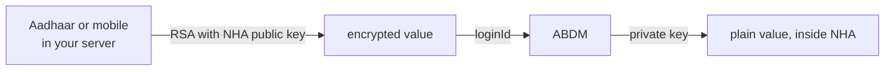

# Why identifiers are encrypted, and where to do it

## In plain words

Across M1, the value you put in `loginId` is not the raw Aadhaar,
ABHA or mobile number. It is that value encrypted against NHA's public
key.

The same applies to OTP values on several calls.

What you encrypt has a shape, and the service checks it after it
decrypts. An ABHA number is `NN-NNNN-NNNN-NNNN`, dashes included, for
example `91-1234-5678-9015`. An Aadhaar number is 12 digits with no
spaces. A mobile number is 10 digits with no country code. Encrypting an
ABHA number as 14 bare digits is rejected: a login OTP request sent that
way on the sandbox on 2026-09-11 returned
`400 {"loginId": "LoginId is invalid"}`, and the same number with its
dashes passed validation and went on to look the account up.

## Before you start

You need the public key for the path you are calling: the profile key
for `/v3/profile/*` and `/v3/enrollment/*`, the PHR key for `/v3/phr/*`.
See [the two public keys](hiecm.concept.two-public-keys). Read [the gateway session](gateway-session.md) first, since
that call needs a token like any other.

## What happens

The model is straightforward: NHA publishes a public key, you encrypt
locally, only NHA can decrypt.

NHA's collection also contains a hosted helper that encrypts a value for
you, and two third party encryption websites. Those are conveniences for
trying a flow by hand.

## How you know it worked

You have understood this when you can answer both of these.

  1. Where in your architecture does the raw Aadhaar number exist, and for
     how long?
  2. What is wrong with calling a remote endpoint to encrypt it?

## When it goes wrong

Using the hosted encryption helper in a production path. Sending an
Aadhaar number to a remote service so that it can be encrypted defeats
the purpose of encrypting it, and NHA's own collection contains examples
pointed at third party websites. Encrypt locally.

Logging the plain value before encryption. That is the same leak, moved
into your log store.

Encrypting the right value in the wrong shape. Two refusals read almost
the same and mean different things. `"loginId": "Invalid LoginId"` means
the service could not decrypt what you sent, which is a key or a padding
problem. `"loginId": "LoginId is invalid"` means it decrypted and then
failed a format rule, so the plaintext shape is wrong.

