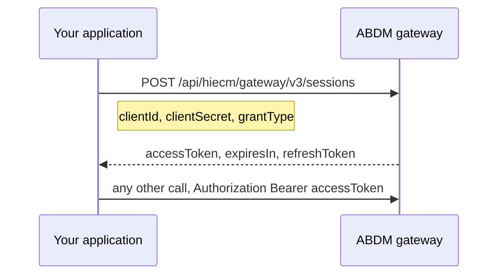

# The gateway session, the first call in every integration

## In plain words

Before anything else, your application exchanges its client id and client
secret for an access token. That token goes on every other call as
`Authorization: Bearer`.

The token identifies your application. It does not identify a patient.
That distinction matters in M1, where user scoped calls need a second
token as well.

## Before you start

You need a client id and secret from registering on the ABDM sandbox.
See [registration and credentials](../../shared/sandbox/registration-and-credentials.md).

## What happens

One endpoint issues the token, and every module uses it, including M4 on
its different host.

Two tokens exist in M1 and they are not interchangeable. The session
token says which application is calling. The `X-token` returned by login
says which person the call is about. Profile calls need both.

## How you know it worked

You have understood this when you can answer both of these.

  1. Your token stops working after some hours. Where do you read the
     lifetime from, and what should you not do instead?
  2. A profile read returns an authorisation error although the session
     token is fresh. What is missing?

## When it goes wrong

Hardcoding a token lifetime. NHA has changed it, so read `expiresIn`
rather than assuming.

Putting the client secret in a mobile or browser build. It is a
credential and belongs server side.

