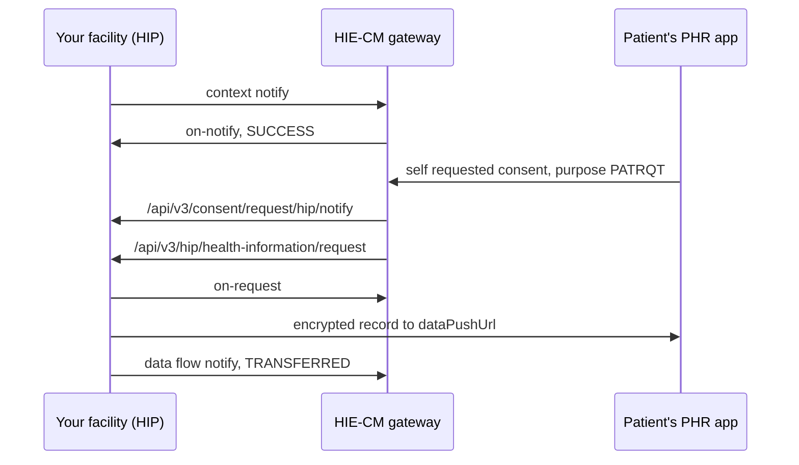

# Linking triggers the patient's app to fetch the record at once

## In plain words

Linking is not the end of the HIP's work for a visit. It is the start of
a data flow you did not initiate. When the context notify is
acknowledged, the patient's [PHR](shared.glossary.phr) app raises a
consent on the patient's own behalf and pulls the newly linked record.
Your bridge sees the whole M2 data flow within seconds, without any HIU
being involved.

## Before you start

- The linking flow, end to end. See [link a care context](hiecm.flow.m2-link-care-context).
- What a consent artefact carries. See [the consent artefact](hiecm.concept.consent-artefact).

## What happens

Within about five to ten seconds of the notify acknowledgement, two
callbacks land on your bridge in order:

1. [The consent notification](hiecm.callback.m3-on-consent-request-notify-hip)
   with `purpose.code` of `PATRQT`, "Self Requested", naming the care
   context you linked a moment ago.
2. [The health information request](hiecm.callback.m2-on-health-information-request)
   for that consent, carrying a `dataPushUrl` and key material.

You acknowledge the request, encrypt the record and push it, then send
the [data flow notify](hiecm.endpoint.m2-hip-data-flow-notify). This is
the ordinary M2 data flow. The only difference is when it happens.

So the record for a care context must be ready to serve, as a valid
[FHIR](shared.glossary.fhir) bundle, before you link that care
context. Linking a reference and building the document later means the
first fetch fails.

## How you know it worked

You have understood this when you can answer both of these.

1. You linked a care context at 10:00:00 and a health information request
   for it arrived at 10:00:08 with no HIU in your test. Who asked?
2. Your system links references at check in and generates the document
   at discharge. What happens at check in?

## When it goes wrong

The record is not yet built when the request arrives. The push fails or
carries an empty bundle, and the patient's app shows a broken record.

The consent notification handler expects a HIU's purpose code and
rejects `PATRQT`.

The HIP treats the unexpected request as an attack and drops it. The
signature verifies; it is the patient.
