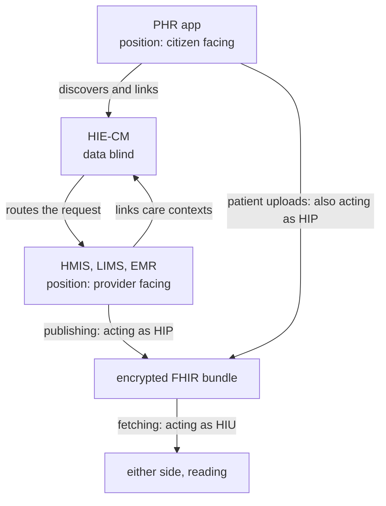

# Roles, what your application is and what it is doing

## In plain words

Asking "which role am I" gets you nowhere until you notice it is two
questions.

**What is your application?** A hospital system and a patient app sit on
opposite sides of the exchange, and that never changes. On the HIE-CM the
two sides are the PHR app, facing the citizen, and the provider facing
system, which is your HMIS, HIMS, HMS, LIMS or EMR. This is a position,
and it is fixed for the life of the product.

**What is it doing right now?** Publishing a record makes you a HIP.
Fetching one makes you an HIU. This changes call by call, and either
position can do either thing.

That second point is the one people miss. A PHR app is a HIP the moment a
patient uploads a record into it. A hospital system is an HIU the moment
it pulls a patient's history from another facility. HIP and HIU are not
kinds of company and not kinds of product. They are directions of travel.

## Before you start

Read [ABHA number and address](abha-number-and-address.md), because every
role here routes on the address.

## What happens

The two axes, and the two things that sit outside them:

| | Question | Fixed for | Values |
|---|---|---|---|
| Position | What is this application | The life of the product | HIE-CM: `phr`, `ims`. UHI: `eua`, `hspa`. NHCX: `provider`, `payer` |
| Direction | What is it doing in this call | One interaction | `hip` publishing, `hiu` fetching |
| Custody | Do you hold records | Ongoing | HRP |
| Entity | Who builds the software | The company | DSC |

Position vocabulary changes per gateway, which is why it has to be a
separate axis. On UHI the sides are the end user application and the
health service provider application. On NHCX they are provider and payer.
Direction is the same everywhere.

**Milestones follow the direction, not the position.** M1 is identity, so
everyone does it. M2 is publishing, which is HIP behaviour. M3 is
fetching, which is HIU behaviour. So the question that picks your
milestones is not "what kind of product do I sell" but "does my software
publish records, read them, or both".

Most products do both. A hospital system that shares its own records and
also pulls history needs M2 and M3. A PHR app that accepts uploads needs
M2 as well as M1, which surprises teams who read that PHR apps start at
M1 and stop there.

Records never pass through the consent manager. It routes the request and
holds the consent. The bundle goes provider to requester directly.

## How you know it worked

You have understood this when you can answer all three.

  1. Your product is a hospital system that also lets doctors pull a
     patient's history from elsewhere. What is its position, which
     directions does it take, and which milestones does it need?
  2. A patient uploads a scanned prescription into your PHR app. Which
     direction is the app acting in, and what does that imply?
  3. A record moves from a lab to an insurer. Name every party that sees
     the clinical content.

## When it goes wrong

Picking one role for the company. NHA's own material lists HIP, HIU, HRP
and health locker together as though an integrator should choose one, and
they are not comparable: two are directions, one is custody, and the
fourth is a kind of product. See
[the two axis decision](../../shared/decisions/role-model-two-axes.md).

Building a PHR app for M1 alone. The moment it accepts an upload it is
publishing, and publishing is M2.

Assuming the consent manager stores records, and designing a fetch
against it. It is data blind by design.
