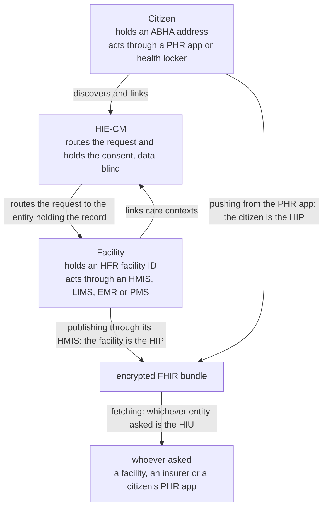

# Roles, which entity your software acts for and which way the record moves

## In plain words

Asking "which role am I" gets you nowhere until you notice it is two
questions, and that neither of them is about your software.

Two entities hold identity on this network. The citizen holds an
[ABHA](../../shared/glossary/abha.md) address. The facility holds a
facility ID issued by the [HFR](../../shared/glossary/hfr.md). Those two
are where records are created and held, and your software is how one of
them takes part.

**Which entity does your software act for?** A facility acts through its
[HMIS](../../shared/glossary/hmis.md), also written HIMS or HMS, a
[LIMS](../../shared/glossary/lims.md), an
[EMR](../../shared/glossary/emr.md) or a
[PMS](../../shared/glossary/pms.md). A citizen acts through a PHR app or
a health locker. That is a position, and it is fixed for the life of the
product.

**Which way is the record moving?** The entity publishing a record is the
[HIP](../../shared/glossary/hip.md). The entity fetching one is the
[HIU](../../shared/glossary/hiu.md). This changes call by call, and
either entity can take either role. An organisation that holds neither
identity, an insurer for example, is the HIU whenever it asks to read
records it did not create.

That second point is the one people miss. A citizen linking or pushing a
record from their PHR app is the HIP. A facility fetching a patient's
history through the same HMIS it publishes with is the HIU. HIP and HIU
are not kinds of company and not kinds of product. They are the two ends
of one record moving.

## Before you start

Read [ABHA number and address](abha-number-and-address.md), because every
role here routes on the address.

## What happens

The two axes, and the two things that sit outside them:

| | Question | Fixed for | Values |
|---|---|---|---|
| Position | Which entity does this software act for | The life of the product | HIE-CM: `phr` for a citizen, `ims` for a facility. UHI: `eua`, `hspa`. NHCX: `provider`, `payer` |
| Direction | Which way is the record moving in this call | One interaction | `hip` publishing, `hiu` fetching |
| Custody | Who holds the records | Ongoing | HRP |
| Vendor | Who builds the software | Ongoing | DSC |

Position vocabulary changes per gateway, which is why it has to be a
separate axis. On UHI the sides are the end user application and the
health service provider application. On NHCX they are provider and payer.
Direction is the same everywhere.

**Milestones follow the direction, not the position.** M1 is identity, so
everyone does it. M2 is publishing, which is HIP behaviour. M3 is
fetching, which is HIU behaviour. So the question that picks your
milestones is not "what kind of product do I sell" but "does the entity I
act for publish records, read them, or both".

Most entities do both. A facility that shares its own records and also
pulls a patient's history needs M2 and M3, through the one HMIS. A
citizen who pushes records from a PHR app needs M2 as well as M1, which
surprises teams who read that PHR apps start at M1 and stop there.

Records never pass through the consent manager. It routes the request and
holds the consent. The bundle goes provider to requester directly.

## How you know it worked

You have understood this when you can answer all three.

  1. You build a hospital system that also lets doctors pull a patient's
     history from elsewhere. Which entity does it act for, which
     directions does that entity take, and which milestones does it need?
  2. A patient uploads a scanned prescription into your PHR app. Which
     entity is taking which role, and what does that imply?
  3. A record moves from a laboratory to an insurer. Name every party
     that sees the clinical content.

## When it goes wrong

Picking one role for the company. HIP, HIU, HRP and the health locker get
listed together as though an integrator should choose one, and they are
not comparable: two are directions a record travels, one is custody, and
the fourth is a kind of product. See
[the two axis decision](../../shared/decisions/role-model-two-axes.md).

Building a PHR app for M1 alone. The moment a citizen pushes a record
from it, that citizen is publishing, and publishing is M2.

Assuming the consent manager stores records, and designing a fetch
against it. It is data blind by design.
