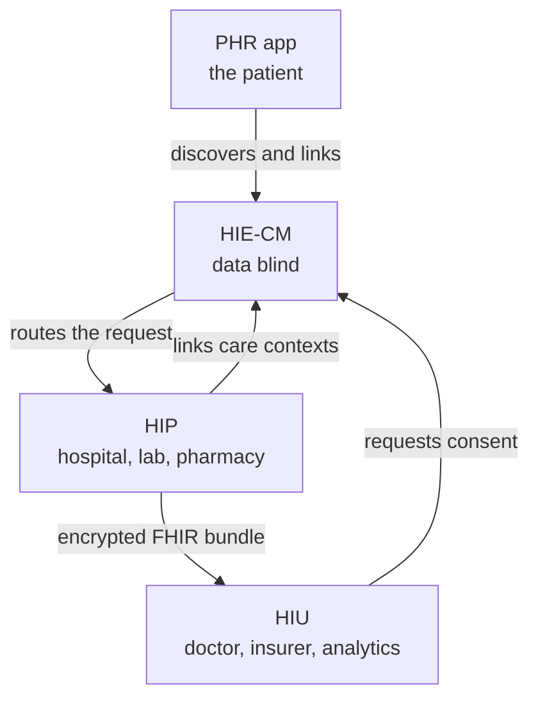

# HIP, HIU and PHR, the three roles and which one you are

## In plain words

ABDM does not classify companies. It classifies what your system is doing
in a given interaction, and there are three roles.

A [HIP](../../shared/glossary/hip.md) holds records and gives them out. A
[HIU](../../shared/glossary/hiu.md) asks to read somebody else's records.
A [PHR app](../../shared/glossary/phr.md) is the patient's own view.

Which role you are decides which milestone you implement.

## Before you start

Read [ABHA number and address](abha-number-and-address.md) first, because all three roles route on the address.

## What happens

The mapping to milestones is direct. A PHR app or any system that
registers patients needs M1. A system that creates records and shares
them is a HIP and needs M2. A system that reads other people's records is
an HIU and needs M3.

Note what the diagram does not show: records never pass through the
consent manager. It routes the request and holds the consent. The bundle
goes provider to requester.

## How you know it worked

You have understood this when you can answer both of these.

  1. Your product is a hospital system that also lets doctors pull a
     patient's history from elsewhere. Which roles is it, and which
     milestones does it need?
  2. A record moves from a lab to an insurer. Name every party that sees
     the clinical content.

## When it goes wrong

The common mistake is picking one role for the company. A hospital system
is usually both a HIP and an HIU, and needs M2 and M3.

The expensive mistake is assuming the consent manager stores records, and
designing a fetch against it. It is data blind by design.

