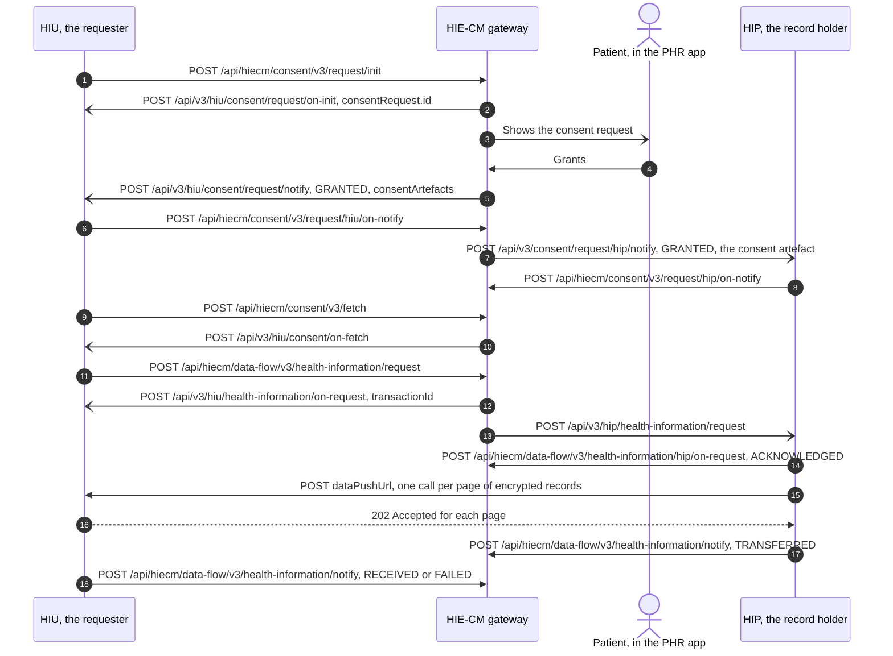

# From a consent request to records received, role by role

## In plain words

A doctor, an insurer or a patient's own app wants to read a health record
that another hospital holds. Nobody can read it until the patient says yes.

Three parties take part. The requester asks. The patient decides in their
health app. The record holder checks the permission and sends the record.
ABDM sits between them: it carries the question, the answer and the
permission, and it never sees the record itself.

The record goes straight from the holder to the requester, locked so that only
the requester can open it. At the end both sides tell ABDM what happened, so
the patient has a trail of who received what.

In ABDM's terms the requester is the
[HIU](/docs/hiecm/v3/getting-started/glossary#hiu), the record holder is the
[HIP](/docs/hiecm/v3/getting-started/glossary#hip), and the service between
them is the [HIE-CM](/docs/hiecm/v3/getting-started/glossary#hie-cm). The
patient uses a [PHR](/docs/hiecm/v3/getting-started/glossary#phr) application.

## Before you start

- Each side holds a gateway session token. See
  [the gateway session](/docs/hiecm/v3/concepts/gateway#gateway-session).
- Each side has a callback URL registered and reachable from the public
  internet. See [sandbox access](/docs/hiecm/v3/getting-started/sandbox#3-register-your-callback-url).
- The requester's facility is linked to its bridge with type `HIU`, and the
  record holder's with type `HIP`. See
  [linking bridges to a facility](/docs/hiecm/v3/milestones/m4#m4-link-bridge).
- The record holder has already linked a care context to the patient's
  [ABHA address](/docs/hiecm/v3/getting-started/glossary#abha-address). An
  unlinked record cannot be reached by any consent request. See
  [HIP initiated linking](/docs/hiecm/v3/milestones/m2#m2-link-care-context).
- The requester exposes a `dataPushUrl` of its own that accepts the encrypted
  pages.

## What happens

Every call below answers twice. The response is `202 Accepted`, which only says
the request was received. The answer arrives later as a POST to your callback
URL, and its `response.requestId` carries the `REQUEST-ID` of the call it
answers.

### The requester, as the HIU

| Step | You call | You must handle |
| --- | --- | --- |
| Ask | `POST /api/hiecm/consent/v3/request/init` with the patient's ABHA address, the purpose, the HI types and the date range | `/api/v3/hiu/consent/request/on-init`, which carries `consentRequest.id`. Store it |
| Wait | `POST /api/hiecm/consent/v3/request/status`, only to show progress | `/api/v3/hiu/consent/request/on-status` |
| Receive the decision | Nothing. The decision is pushed to you | `/api/v3/hiu/consent/request/notify` with `status` and, on `GRANTED`, every id in `consentArtefacts` |
| Acknowledge | `POST /api/hiecm/consent/v3/request/hiu/on-notify`, one `acknowledgement` entry per artefact | Nothing |
| Read the permission | `POST /api/hiecm/consent/v3/fetch` for each artefact id | `/api/v3/hiu/consent/on-fetch` with the care contexts, HI types and date range allowed |
| Ask for the records | `POST /api/hiecm/data-flow/v3/health-information/request` with the consent id, a date range inside the artefact's, your `dataPushUrl` and your `keyMaterial` | `/api/v3/hiu/health-information/on-request` with the `transactionId` |
| Receive | Nothing. The HIP posts to your `dataPushUrl` | Each page: answer `202 Accepted`, collect every page up to `pageCount`, decrypt each entry |
| Close | `POST /api/hiecm/data-flow/v3/health-information/notify` with `notifier.type` `HIU` and `sessionStatus` `RECEIVED` or `FAILED` | Nothing |

The status call, the fetch call and the health information request also carry
`X-HIU-ID`.

### The record holder, as the HIP

| Step | You must handle | You call |
| --- | --- | --- |
| Learn of the consent | `/api/v3/consent/request/hip/notify` on your bridge. `GRANTED` carries the full consent artefact and a signature. `REVOKED` and `EXPIRED` name the artefact by `consentId` | `POST /api/hiecm/consent/v3/request/hip/on-notify` with one `acknowledgement` holding `status` and `consentId`, and the notification's request id in `response.requestId` |
| Receive the request | `/api/v3/hip/health-information/request` with the `transactionId`, the consent id, the date range, the `dataPushUrl` and the requester's `keyMaterial` | `POST /api/hiecm/data-flow/v3/health-information/hip/on-request` with the `transactionId` and `sessionStatus` `ACKNOWLEDGED` |
| Check | Nothing arrives | Nothing. Check the consent is active, the date range sits inside the artefact's, and the encryption parameters are usable |
| Send | Nothing arrives | POST each page to the `dataPushUrl`, straight to the HIU and not through the gateway: `pageNumber`, `pageCount`, `transactionId`, `entries` and your `keyMaterial` |
| Close | Nothing arrives | `POST /api/hiecm/data-flow/v3/health-information/notify` with `notifier.type` `HIP`, `sessionStatus` `TRANSFERRED` or `FAILED`, and a `hiStatus` of `DELIVERED` or `ERRORED` per care context |

Every callback to your bridge carries `X-HIP-ID`, which names the facility it
is for.

### The HIE-CM, in between

- It creates the consent request id and shows the request to the patient.
- On a grant it creates the consent artefacts, one for each HIP the consent
  covers, and notifies the HIU and each HIP separately.
- It gives the health information request a `transactionId` and forwards it
  to the HIP.
- It never receives the records. The push goes from the HIP to the HIU's
  `dataPushUrl`.

The transfer has 20 minutes from the start of the request. Treat retrieval and
encryption as a background job.

## How you know it worked

- **As the HIU.** Every entry on every page decrypts, each `checksum` matches,
  and your notify call with `sessionStatus` `RECEIVED` returns
  `202 Accepted`.
- **As the HIP.** The HIU answered `202 Accepted` for each page, and your
  notify call with `sessionStatus` `TRANSFERRED` returns `202 Accepted`.

A grant on its own is not the end. A granted consent with no health
information request behind it leaves the requester with permission and no
records.

## When it goes wrong

- The request stays in Requested although the patient says they approved it:
  see [approved, but still Requested](../troubleshooting/consent-requested-after-patient-approved.md).
- The records arrive but a message says the HIP did not acknowledge the
  consent notification: see
  [HIP did not acknowledge](../troubleshooting/hip-did-not-acknowledge-consent-notify.md).
- A callback never reaches your server: see
  [no callback reaches my server](../troubleshooting/no-callback-on-my-server.md).
- `ABDM-1062`, "Consent Not granted": the patient revoked the consent, or it
  lapsed, between your request and the HIP's check. See
  [ABDM-1062](/docs/hiecm/v3/api/m2/errors#abdm-1062).
- `ABDM-1063`, "Date Range given is invalid": you asked for dates outside
  the artefact's range. A wider window is refused, not trimmed. See
  [ABDM-1063](/docs/hiecm/v3/api/m2/errors#abdm-1063).
- `ABDM-1112`: the artefact id is invalid or already expired. Raise a new
  consent request. See [ABDM-1112](/docs/hiecm/v3/api/m2/errors#abdm-1112).

## Questions this answers

- Explain the complete consent and data sharing flow from consent request creation until health records are received by the HIU.
- What does the HIP have to do when a consent is granted?
- Which callbacks must the HIU handle between raising consent and getting the records?
- Does the health record pass through the ABDM gateway?
- Who tells ABDM that the data transfer finished?
