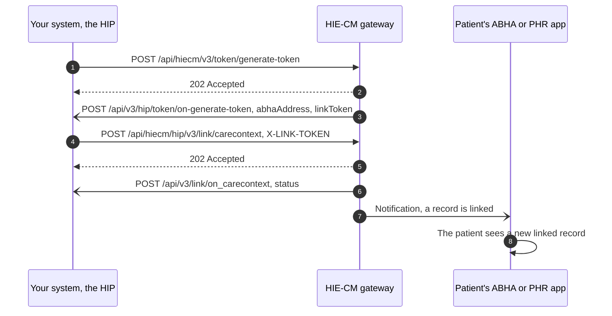

# HIP initiated linking from start to finish, and what the patient then sees

## In plain words

A patient visits a hospital and gives their health account address at the
desk. The hospital creates a record of the visit. Linking tells ABDM that
this hospital holds something for this patient, so the patient can see it in
their health app and share it later.

The hospital starts this, which is why it is called HIP initiated linking.
The other route is user initiated linking, where the patient goes looking
from their app.

| | HIP initiated linking | User initiated linking |
| --- | --- | --- |
| Who starts it | The facility | The patient, from their app |
| When it applies | The patient shared their ABHA address with the facility | The record was created earlier without an ABHA address |
| How the patient is confirmed | A link token | A one time password the facility sends |
| Where it is told | This atom | [User initiated linking](journey-user-initiated-linking.md) |

Only a pointer is linked: a reference number and a display name. The record
itself stays with the hospital until somebody asks for it with the patient's
consent.

In ABDM's terms the hospital is the
[HIP](/docs/hiecm/v3/getting-started/glossary#hip), the pointer is a
[care context](/docs/hiecm/v3/getting-started/glossary#care-context), the
account address is the
[ABHA address](/docs/hiecm/v3/getting-started/glossary#abha-address), and the
patient's app is a [PHR](/docs/hiecm/v3/getting-started/glossary#phr)
application.

## Before you start

- The facility holds a facility ID and a bridge linked with type `HIP`. See
  [from sandbox registration to a HIP ID](../../shared/sandbox/sandbox-to-hip-or-hiu-id.md).
- You hold a gateway session token. See
  [the gateway session](/docs/hiecm/v3/concepts/gateway#gateway-session).
- Your callback URL is registered and reachable from the public internet.
- The patient has an ABHA address and gave it to you.

## What happens

| Step | Who | Call or callback |
| --- | --- | --- |
| 1. Ask for a link token | You call | `POST /api/hiecm/v3/token/generate-token` with `abhaAddress`, `name`, `gender` and `yearOfBirth`, and `abhaNumber` when the patient has one linked to the address. Headers: `REQUEST-ID`, `TIMESTAMP`, `X-CM-ID`, `X-HIP-ID` |
| 2. Receive the token | You handle | `/api/v3/hip/token/on-generate-token` on your bridge. It carries `abhaAddress`, `response` and either `linkToken` or `error`. Store the token against the patient |
| 3. Link | You call | `POST /api/hiecm/hip/v3/link/carecontext` with the token in `X-LINK-TOKEN` and the care contexts in the body |
| 4. Receive the result | You handle | `/api/v3/link/on_carecontext` on your bridge. `status` reads `Successfully Linked care context`, or `Failed to link care context` with an `error` |
| 5. The patient is told | Nothing for you to do | The gateway notifies the patient's ABHA or PHR app that a record is linked |

A link token is valid for six months. Store it and reuse it for every link
you make for that patient, and ask for a new one only when it has expired.

### The call that links

`POST /api/hiecm/hip/v3/link/carecontext` is the call a HIP makes to the
gateway to perform HIP initiated linking. Its own summary reads "This API
will be used to perform HIP initiated linking." The result does not come back
on that call. It arrives on your bridge at `/api/v3/link/on_carecontext`.

The body requires `abhaAddress` and `patient`. Each `patient` entry requires
`referenceNumber`, `display`, `careContexts`, `hiType` and `count`, and
`count` must equal the number of care contexts sent.

`abhaNumber` is not in the required list. One rule sits on top of that: if
the link token was generated with both `abhaNumber` and `abhaAddress`, send
both again on the link call. Otherwise one of the two is enough. When you
send `abhaNumber`, it is 14 digits and nothing else.

### What the patient's app shows

After a successful link the care contexts are available in the patient's PHR
application, and the patient sees a new record linked. What is linked is the
pointer. The app shows the contents only after it fetches the record with
consent, which is [fetching and storing records](/docs/hiecm/v3/milestones/p3#p3-fetch-records).

When a linked care context later gains new records, tell ABDM with
`POST /api/hiecm/hip/v3/link/context/notify`. The outcome arrives at
`/api/v3/links/context/on-notify`.

## How you know it worked

A POST reaches `/api/v3/link/on_carecontext` whose `response.requestId`
equals the `REQUEST-ID` of your link call and whose `status` reads
`Successfully Linked care context`. The `202 Accepted` on the link call is
receipt, not success.

## When it goes wrong

- The callback said linked, and the patient still sees nothing: see
  [linked, but the patient sees no record](../troubleshooting/linked-but-patient-sees-no-record.md).
- The token callback carries `ABDM-1027`, "You are blocked. Please try again
  after 24 hours.": see
  [blocked for 24 hours](../troubleshooting/blocked-for-24-hours-on-generate-token.md).
- No callback arrives at all: see
  [no callback reaches my server](../troubleshooting/no-callback-on-my-server.md).
- `ABDM-1026`, "Invalid Link Token", or a mismatch code beside it: see
  [ABDM-1026](/docs/hiecm/v3/api/m2/errors#abdm-1026).
- `ABDM-1056`, the care context is already linked: see
  [ABDM-1056](/docs/hiecm/v3/api/m2/errors#abdm-1056).
- `ABDM-1035`, "Invalid HIP ID": the facility is not registered or not
  linked to your bridge. See
  [ABDM-1035](/docs/hiecm/v3/api/m2/errors#abdm-1035).

## Questions this answers

- Which API endpoint is used to link records through hip initiated linking flow?
- What is the difference between User Initiated Linking and HIP Initiated Linking?
- Is the ABHA number mandatory in /v3/link/carecontext?
- What does the patient see in their app after the hospital links a record?
- How long is a link token valid, and do I generate one for every visit?
