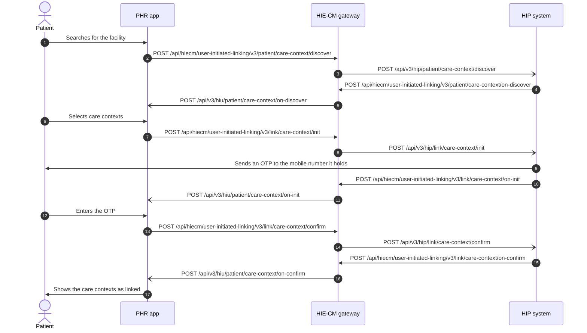

# User initiated linking from a PHR app, with the HIP's side of each step

## In plain words

A patient visited a hospital before they had a health account, or never gave
the account address at the desk. The record exists at the hospital, and the
patient's health app cannot see it.

User initiated linking fixes that from the patient's side. In their app the
patient searches for the hospital. The hospital looks for a matching patient
and answers with the visits it holds. The patient picks the visits to attach.
The hospital sends a one time password to the mobile number it has on file,
the patient types it into the app, and the visits are attached to the
patient's account.

This is how records are linked to an
[ABHA address](/docs/hiecm/v3/getting-started/glossary#abha-address) from a
[PHR](/docs/hiecm/v3/getting-started/glossary#phr) application. The hospital
is the [HIP](/docs/hiecm/v3/getting-started/glossary#hip), each visit is a
[care context](/docs/hiecm/v3/getting-started/glossary#care-context), and the
one time password is an
[OTP](/docs/hiecm/v3/getting-started/glossary#otp). The other route, where
the hospital starts, is
[HIP initiated linking](journey-hip-initiated-linking.md).

Every HIP must answer discovery, even one whose patients all give an ABHA
address at the counter, because a patient who visited two years ago did not.

## Before you start

- **The PHR app.** The person is signed in and holds an ABHA address. See
  [P1 Registration and login](/docs/hiecm/v3/milestones/p1).
- **The PHR app.** The search lists only facilities that are HIPs with an
  active bridge link.
- **The HIP.** The facility holds a facility ID and a bridge linked with type
  `HIP`. See
  [from sandbox registration to a HIP ID](../../shared/sandbox/sandbox-to-hip-or-hiu-id.md).
- **Both.** A gateway session token, and a callback URL registered and
  reachable from the public internet.

## What happens

Three exchanges, in order: discover, init, confirm. In each one the PHR app
calls the gateway, the gateway calls the HIP's bridge, the HIP replies to the
gateway, and the gateway calls the PHR app back.

| Step | The PHR app calls | The HIP receives on its bridge | The HIP calls | The PHR app receives |
| --- | --- | --- | --- | --- |
| Discover | `POST /api/hiecm/user-initiated-linking/v3/patient/care-context/discover` with the `hip` and the `unverifiedIdentifiers` | `/api/v3/hip/patient/care-context/discover` with the transaction id and the patient's id, name, gender, date of birth and verified identifiers | `POST /api/hiecm/user-initiated-linking/v3/patient/care-context/on-discover` with the matching care contexts | `/api/v3/hiu/patient/care-context/on-discover` |
| Init | `POST /api/hiecm/user-initiated-linking/v3/link/care-context/init` with the selected care contexts | `/api/v3/hip/link/care-context/init` | `POST /api/hiecm/user-initiated-linking/v3/link/care-context/on-init` with a link reference number, authentication type `DIRECT`, and the communication medium, hint and expiry | `/api/v3/hiu/patient/care-context/on-init` |
| Confirm | `POST /api/hiecm/user-initiated-linking/v3/link/care-context/confirm` with the OTP and the link reference number | `/api/v3/hip/link/care-context/confirm` with the link reference number and the token | `POST /api/hiecm/user-initiated-linking/v3/link/care-context/on-confirm` with the linked care contexts | `/api/v3/hiu/patient/care-context/on-confirm` |

What each side does between the calls:

- **Discover, at the HIP.** Match against your own patients. Weigh the
  verified identifiers above the patient declared ones. Answer with a
  reference number and a display name for each care context, and nothing
  clinical. A HIP is expected to answer a discovery request within 10 seconds.
- **Discover, in the PHR app.** Show only the care contexts that are not
  already linked.
- **Init, at the HIP.** Send the OTP to the mobile number you registered for
  that patient, then reply with on-init.
- **Confirm, at the HIP.** Validate the OTP, then reply with on-confirm.

Three outcomes have specified copy in the PHR app.

| Situation | Message |
| --- | --- |
| The HIP is unreachable | "Couldn't Connect: We are sorry. Unable to contact your hospital. Please try again later" |
| The user never visited the facility | "No health records found" |
| Everything is already linked | "No new health record to link: Records of all visits are already linked and there is nothing new to link" |

## How you know it worked

The on-confirm callback at `/api/v3/hiu/patient/care-context/on-confirm`
lists the linked care contexts. Discovery against the same facility now
returns them as already linked, not as new.

A linked care context is not a record in hand. Reading it is a consent flow:
see [fetching and storing records](/docs/hiecm/v3/milestones/p3#p3-fetch-records).

## When it goes wrong

- One of the three exchanges was accepted and then stalled: see
  [accepted, then nothing](/docs/hiecm/v3/troubleshooting/accepted-then-nothing),
  which finds the missing callback in the chain.
- Discovery returns nothing. The name or date of birth given at the facility
  often differs from the profile.
- The OTP does not reach the patient. It goes to the mobile number the
  facility registered, which the person may no longer use.
- `ABDM-1056`: the care context is already linked, or the link reference
  number matches nothing issued in this flow. See
  [ABDM-1056](/docs/hiecm/v3/api/m2/errors#abdm-1056).
- `ABDM-2406`: a step was sent before the previous step's callback arrived.
  See [ABDM-2406](/docs/hiecm/v3/api/m2/errors#abdm-2406).
- The care contexts are linked and the patient still sees no record: see
  [linked, but the patient sees no record](../troubleshooting/linked-but-patient-sees-no-record.md).

## Questions this answers

- How records are linked to ABHA address in PHR application?
- How does a patient find old hospital records from their health app?
- Who sends the OTP in user initiated linking, the hospital or ABDM?
- Which callbacks does a HIP have to handle for discovery and linking?
- Why does discovery show no records for a patient who did visit the hospital?
