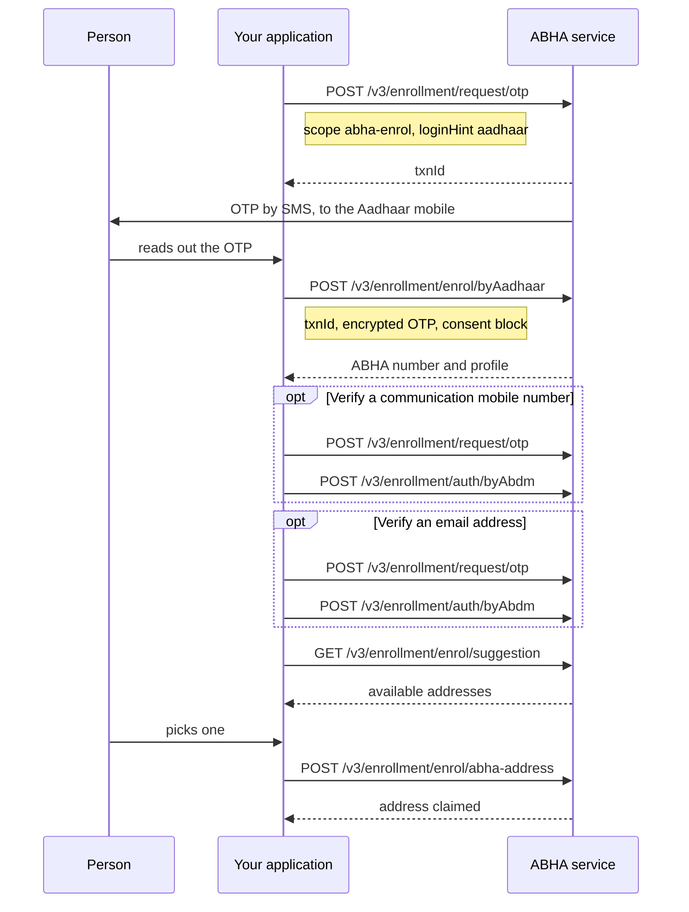

# Create an ABHA using an Aadhaar OTP

## In plain words

This is the route every integrator must implement. The person proves who
they are with an OTP sent to the mobile registered against their Aadhaar,
ABDM issues them a fourteen digit
[ABHA number](shared.glossary.abha-number), and then they claim
a memorable [ABHA address](shared.glossary.abha-address).

NHA makes this route mandatory for every integrator, private or
government. Face authentication and the fingerprint and iris routes are
optional for both. Demographic authentication is mandatory for government
integrators and is not asked of private ones. See
[creation by demographic authentication](hiecm.flow.m1-create-abha-demographic-auth).

## Before you start

- A client id and secret, and a working session token. See
  [registration and credentials](shared.sandbox.registration-and-credentials).
- The person's Aadhaar number, encrypted with RSA-OAEP with SHA-1, base64 encoded, under the 4096-bit certificate from `/v3/profile/public/certificate`. PKCS#1 v1.5 and OAEP with SHA-256 are both refused, and neither refusal names encryption. See
  [why identifiers are encrypted](hiecm.concept.encrypted-identifiers).
- The person present, because they must read an OTP from their phone.
- Their explicit consent to create an ABHA, which you send in the
  enrolment call.

## What happens

Eight calls in NHA's collection, of which the mobile and email
verification pairs are optional.

Nothing here waits on a callback. Every step answers in its response,
which is what makes M1 easier than M2 and M3.

The enrolment call is the one with a permanent effect. Everything before
it can be repeated safely; that call creates an account.

## How you know it worked

The person has an ABHA number, and an address they chose rather than the
digits-based default.

Confirm it by reading the profile back and checking that the address you
claimed is present and marked preferred. Do not treat the enrolment
response alone as the end of the flow: an account with only the default
address is a half finished job the person will not recognise later.

## When it goes wrong

The OTP never arrives. The mobile registered against Aadhaar is not
necessarily the one the person is holding, and only the Aadhaar mobile
receives this OTP.

The enrolment call fails after the OTP was accepted. Do not retry it
blindly, because a retry that succeeds may enrol the person twice. Start
a fresh transaction instead.

The chosen address is refused. NHA's policy requires at least four
characters, no leading digit, and no leading or trailing dot. Validate
before submitting so the person is not guessing.

Every call fails with a header error. Check
[ABDM-2402](hiecm.error.abdm-2402) and
[ABDM-2404](hiecm.error.abdm-2404) before assuming the flow is wrong.

