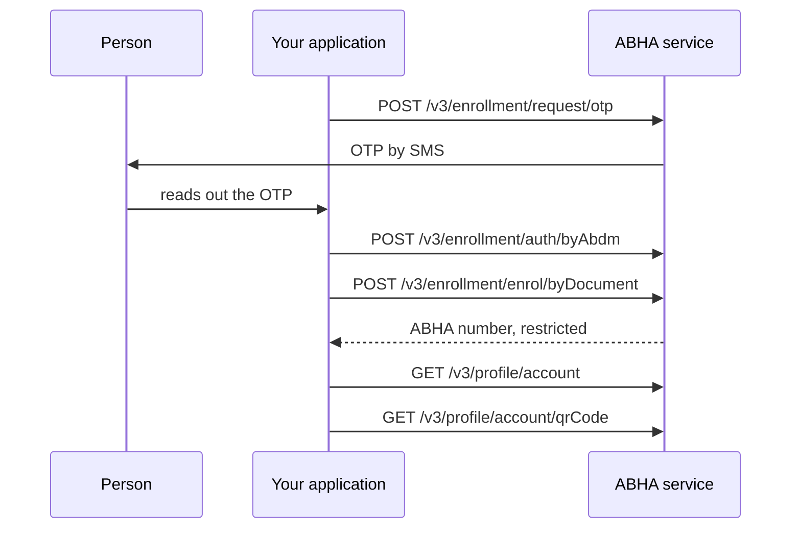

# Create an ABHA from an identity document

## In plain words

NHA does not recommend this route to integrators. Their review of
2026-09-11 asked for it to come out of the recommended M1 flow, and it is
not in the simplified flow they supplied with that review. It is kept
here because the call is in the specification and people find it there.

When neither an Aadhaar OTP nor a biometric capture is possible, NHA
allows enrolment from an identity document. NHA's collection uses a
driving licence.

The account this produces is restricted until it is upgraded through
Aadhaar KYC. Say so to the person rather than letting them find out when
something fails.

## Before you start

- A working session token.
- The person's mobile number, and the person present to read an OTP.
- The document details.

## What happens

NHA's collection ends this flow by reading the profile and fetching the
QR code, which is a reasonable way to show the person what they now have.

## How you know it worked

The profile read returns an account, and the QR code call returns an
image.

Because the account is restricted, also confirm what it cannot yet do
before telling the person they are finished.

## When it goes wrong

The person expects full functionality. A document based account is
restricted, and the limits appear later as unexplained refusals unless
you say so at creation.

The document is not accepted. NHA's collection only exercises a driving
licence, so treat other document types as unproven until you have run
them.

