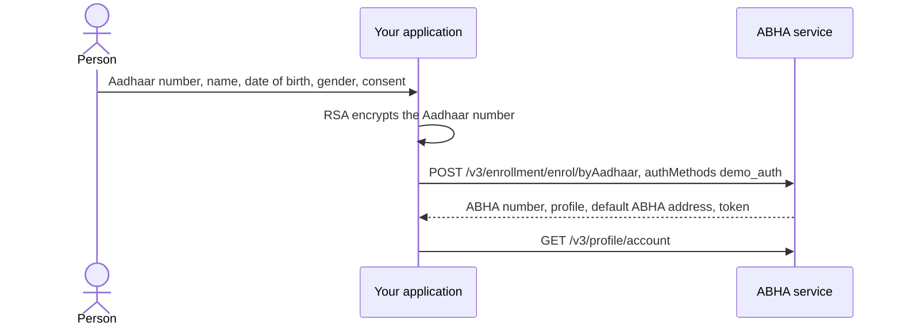

# Create an ABHA using Aadhaar demographic authentication

## In plain words

The person gives their Aadhaar number and the name, date of birth and
gender recorded against it. Aadhaar matches those or refuses them, and no
one time password and no fingerprint reader is involved.

NHA makes this route mandatory for government integrators and does not
ask private integrators for it at all. If you are building a private
integration, read the Aadhaar OTP route instead.

## Before you start

- A working gateway session token. See
  [the gateway session](hiecm.concept.gateway-session).
- The public certificate, because the Aadhaar number is encrypted before
  it is sent. See [fetch the public certificate](hiecm.endpoint.m1-get-public-certificate).
  It arrives as base64 DER and needs PEM armour before your library will
  load it.
- The padding, which is RSA-OAEP with SHA-1, base64 encoded, under the 4096-bit certificate from `/v3/profile/public/certificate`. PKCS#1 v1.5 and OAEP with SHA-256 are both refused, and neither refusal names encryption. See
  [why identifiers are encrypted](hiecm.concept.encrypted-identifiers).
- The person's name exactly as Aadhaar holds it, their date of birth and
  their gender. A near miss on any of them is a refusal, not a warning.
- Their consent, recorded the same way the other enrolment routes record it.

## What happens

One call creates the account. `authMethods` carries `demo_auth`, and the
`demo_auth` block carries the encrypted `aadhaarNumber`, the full `name`
as per Aadhaar, `dob` as `YYYY-MM-DD` and `gender`. All four are
required.

Two differences from the OTP route matter to the code you write:

- The user token comes back as `token` at the top level, where the OTP,
  face and fingerprint variants put it under `tokens.token`. A client that
  reuses its OTP parsing here reads nothing.
- The account is issued with a default ABHA address already generated,
  which is the fourteen digit number followed by `@sbx` or `@abdm`. This
  is why the specification marks claiming an address optional on this
  route and mandatory on the others. Nobody can remember that address, so
  offer the person a readable one anyway through
  [address suggestions](hiecm.endpoint.m1-enrolment-address-suggestions).

## How you know it worked

The enrolment response carries an ABHA number and a profile, and
[reading the profile](hiecm.endpoint.m1-profile-get-account) with the
token from that response returns the same account rather than a 401.

The profile already carries an ABHA address, which is what tells you the
default was generated and that this was the demographic route rather than
one that still owes an address.

## When it goes wrong

- The demographics do not match Aadhaar. The specification names
  `INVALID_DEMOGRAPHIC_DETAILS`. Which field failed is not published, so
  your screen has to ask the person to check all of them.
- The parsing reads no token, because the code looked under `tokens` and
  the value is at the top level.
- The person is surprised by an unreadable ABHA address, because the
  default was generated and nobody offered them a choice.

Nothing in this flow has been run against the sandbox from this
repository, so treat the step order as documented rather than proven.
