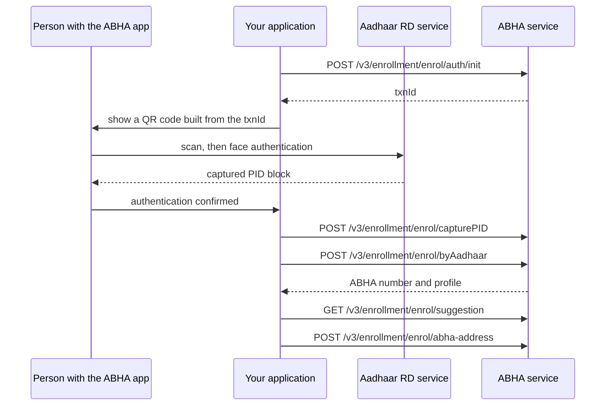

# Create an ABHA using Aadhaar face authentication

## In plain words

Some people cannot use the OTP route, usually because the mobile
registered against their Aadhaar is no longer theirs. Face
authentication is NHA's optional alternative.

The person authenticates their face through the Aadhaar RD service on a
phone, and your application continues the enrolment with the result.

## Before you start

- Everything the OTP route needs. See
  [create an ABHA using an Aadhaar OTP](m1-create-abha-aadhaar-otp.md).
- The ABHA app installed on the person's phone, and the Aadhaar RD
  service available to it.
- A way to show a QR code, because that is how the transaction moves from
  your screen to their phone.

## What happens

The middle of this flow happens on someone else's device, so your
application is waiting on a human rather than on a network call. Show
that state clearly instead of spinning.

The PID block is encrypted by the capture device and is time limited.
Send it immediately rather than storing it.

## How you know it worked

Same ending as the OTP route: the person has an ABHA number and an
address they chose, confirmed by reading the profile back.

The step specific to this route is the capture. You know it worked when
the capture call is accepted rather than when the app says the face
scan succeeded, because those are different events.

## When it goes wrong

The person does not have the ABHA app. The flow cannot start, and the app
store redirect is part of the journey rather than an error.

The PID block is rejected as stale. Captures expire. Recapture rather
than retrying the same block.

The person completes face authentication and nothing happens in your
application. Nothing pushes that result to you, so you must continue the
flow yourself once they confirm.

