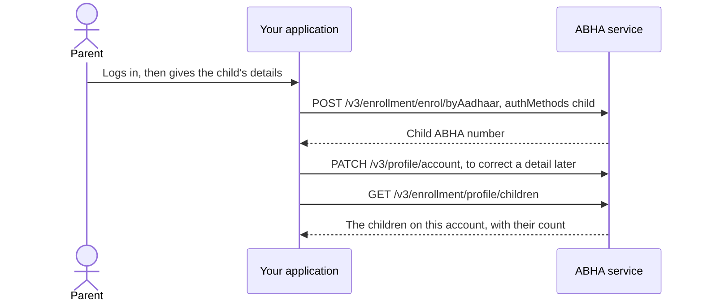

# Create a child ABHA under a parent's account

## In plain words

A parent or guardian holds ABHA accounts for their children under their
own account. The child never authenticates: the parent does, and the
child's account hangs off theirs.

NHA releases this route to specific government integrators, on its
leadership's approval. A private integration does not get it, so build
nothing around it without that approval in hand.

## Before you start

- A working gateway session token. See
  [the gateway session](hiecm.concept.gateway-session).
- The parent logged in, because the create call runs against the parent's
  authenticated session rather than the child's. See
  [login by mobile number](hiecm.flow.m1-login-by-mobile).
- The parent's ABHA number or ABHA address, which identifies them on the
  create call.
- The parent aged 18 or over. Below that the enrolment is refused.
- The child's first name, last name, day, month and year of birth, and
  gender.

## What happens

1. **Create.** The enrolment call is the one the Aadhaar routes use, with
   `authMethods` set to `child`. The `child` block carries `firstName`,
   `lastName`, `dayOfBirth`, `monthOfBirth`, `yearOfBirth` and `gender`,
   and either `parentAbhaNumber` or `parentAbhaAddress`. `middleName` is
   optional.
2. **Update.** A child's name, date of birth or gender is corrected
   through [the profile update](hiecm.endpoint.m1-profile-update-account),
   sending the child's `abhaNumber` with the fields that change.
3. **List.** [The children call](hiecm.endpoint.m1-enrolment-list-children)
   returns the children under the account and their count, against the
   parent's user token.

KYC of a child ABHA is named in NHA's simplified flow and has no
operation in the specification curated here. Ask NHA for it rather than
designing around a guess.

## How you know it worked

The create response carries the child's ABHA number, and listing the
children on the parent's account returns that child with the count raised
by one. The listing is the proof, because the create response on its own
does not tell you the account was attached to the right parent.

## When it goes wrong

- The parent is under 18. The specification names this refusal, and it is
  a rule about the parent rather than the child, which is not obvious from
  the screen the operator is looking at.
- The account has already enrolled as many children as it may. The
  specification names a child enrolment limit per ABHA, so an account that
  worked five times can refuse the sixth.
- The parent is not authenticated, or their token has expired. The create
  call runs against the parent's session, so this reads as an
  authorisation failure rather than as a validation one.

Nothing in this flow has been run against the sandbox from this
repository, so treat the step order as documented rather than proven.
