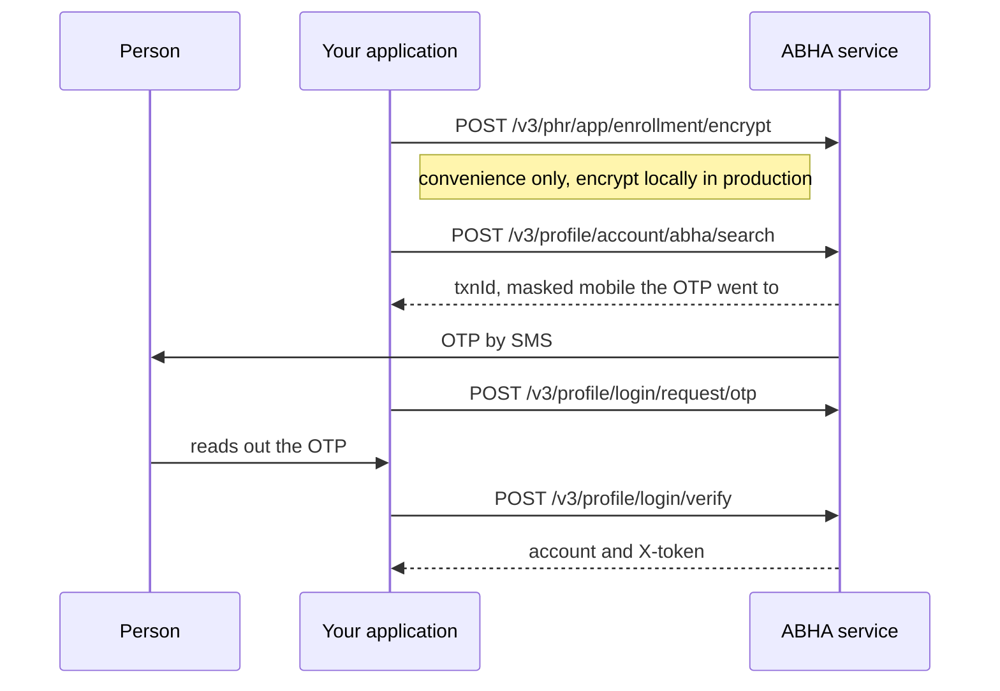

# Find somebody's ABHA when they do not know it

## In plain words

People forget their ABHA. This flow finds it from something they do
remember, usually a mobile number, and then makes them prove the account
is theirs with an OTP before handing anything over.

The proof step is the point. Search alone tells you an account exists.

## Before you start

- A working session token.
- The identifier the person remembers, encrypted.
- The person present to read an OTP.

## What happens

Four calls, in the order NHA's collection uses.

The search response names the masked mobile the OTP was sent to, for
example ending `******0161`. Show that to the person so they can confirm
it is theirs before they wait for a message.

NHA's collection performs the first step by calling a remote encryption
helper, and in two of the four variants a third party website. Do not
copy that. See
[encrypting identifiers locally](../decisions/encrypt-locally.md).

## How you know it worked

You hold the person's ABHA account details and a token for it, and the
masked mobile shown during the search matched the phone they are holding.

If the person could not confirm the masked mobile, the flow has found
somebody else's account and must not continue.

## When it goes wrong

The search finds nothing. The identifier may belong to no account, or to
an account in another environment. A sandbox account does not exist in
production.

The masked mobile is not theirs. Stop. This is the flow working
correctly, and continuing would disclose another person's account.

You are tempted to skip the OTP because search already returned the
account. Do not. Search plus verification is the flow; search alone is a
lookup of somebody else's identity.

