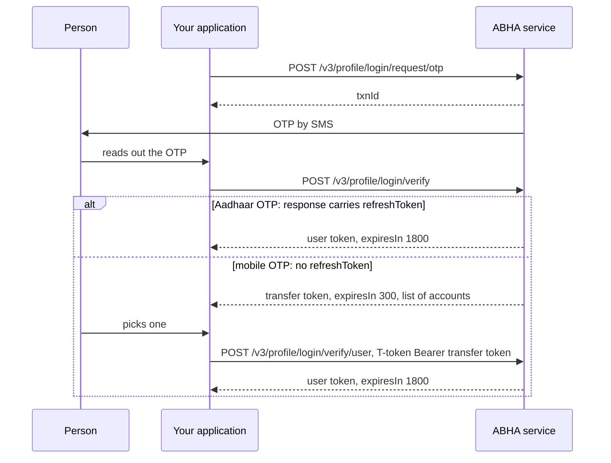

# Log somebody in to their existing ABHA

## In plain words

Logging in is how you get the `X-token` that identifies one person. Every
profile call needs it, sent as `X-token: Bearer <token>`, and it is not
the same as your application's session token.

The flow has two branches, decided by which system sent the OTP. A
mobile OTP returns a transfer token you must exchange for the account
the person picks. An Aadhaar OTP returns the final token at once.

This login lists ABHA numbers, which are always KYC verified. A person
who holds only a self declared ABHA address does not appear here. To
list every address on a mobile, use
[the PHR login by mobile](hiecm.flow.m1-login-phr-by-mobile).

## Before you start

- A working session token.
- The person's mobile number, encrypted with RSA-OAEP with SHA-1, base64 encoded, under the 4096-bit certificate from `/v3/profile/public/certificate`. PKCS#1 v1.5 and OAEP with SHA-256 are both refused, and neither refusal names encryption. See
  [why identifiers are encrypted](hiecm.concept.encrypted-identifiers). See also [the two public keys](hiecm.concept.two-public-keys).
- The person present to read an OTP.

## What happens

1. [Send a login OTP](hiecm.endpoint.m1-login-request-otp).
2. [Verify it](hiecm.endpoint.m1-login-verify). Read the response: if it
   carries `refreshToken`, you are done. If not, go to step 3.
3. [Choose the account](hiecm.endpoint.m1-login-select-account), sending
   the transfer token as `T-token: Bearer <token>`. Do this even when
   `accounts` has one entry.

Handle the account list from the start. An integration that assumes one
account works in testing, where the tester has one, and fails for real
families.

## How you know it worked

You hold a token with `expiresIn: 1800`, and a profile read with
`X-token: Bearer <token>` returns the account the person expected.

The token read back is the check, not the presence of a token. A token
for the wrong account in a multi account household is the failure this
flow exists to prevent.

## When it goes wrong

The verify call returns a 300 second token and a list rather than a
final token. That is the mobile OTP branch, not an error. Exchange it.

The exchange answers `400 Invalid T-token`. You exchanged a final token
from an Aadhaar OTP. Use it as `X-token` directly.

A profile call answers `400 {"message":"Invalid X-token"}`. The token was
sent bare. Send `X-token: Bearer <token>`.

The token is rejected on the next call. See
[ABDM-2401](hiecm.error.abdm-2401), and check you are not sending the
application session token in `X-token`.

Login fails with an authentication error and nothing more specific. See
[900900](hiecm.error.900900).
