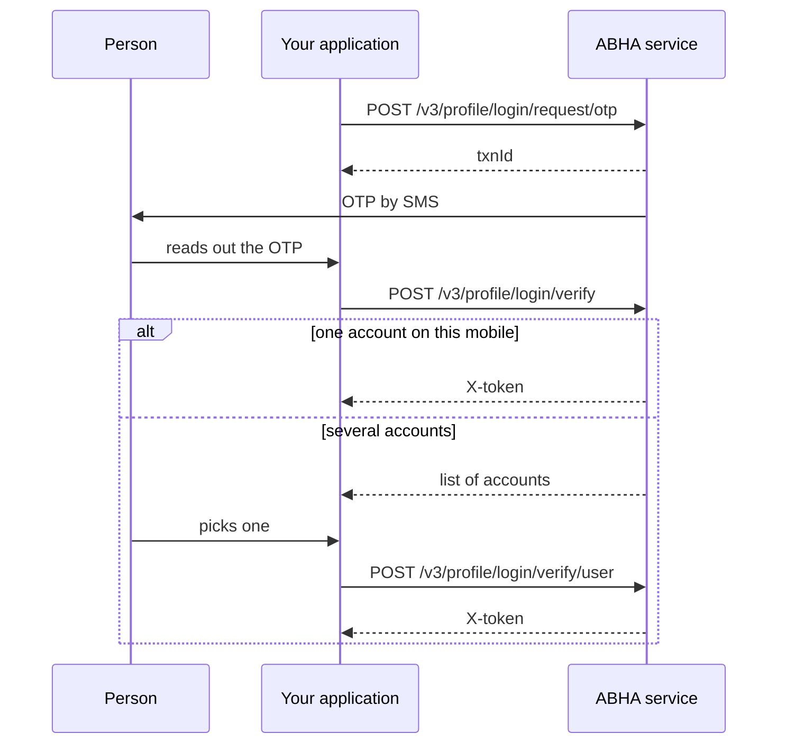

# Log somebody in to their existing ABHA

## In plain words

Logging in is how you get the `X-token` that identifies one person. Every
profile call needs it, and it is not the same as your application's
session token.

One mobile number can carry several ABHA accounts, which is common in a
family, so the flow has a branch.

## Before you start

- A working session token.
- The person's mobile number, encrypted. See
  [why identifiers are encrypted](../concepts/encrypted-identifiers.md).
- The person present to read an OTP.

## What happens

Handle the branch from the start. An integration that assumes one account
works in testing, where the tester has one, and fails for real families.

## How you know it worked

You hold an `X-token`, and a profile read with it returns the account the
person expected.

The token read back is the check, not the presence of a token. A token
for the wrong account in a multi account household is the failure this
flow exists to prevent.

## When it goes wrong

The verify call returns a list rather than a token. That is the multi
account branch, not an error.

The token is rejected on the next call. See
[ABDM-2401](../errors/abdm-2401.md), and check you are not sending the
application session token in `X-token`.

Login fails with an authentication error and nothing more specific. See
[900900](../errors/900900.md).

