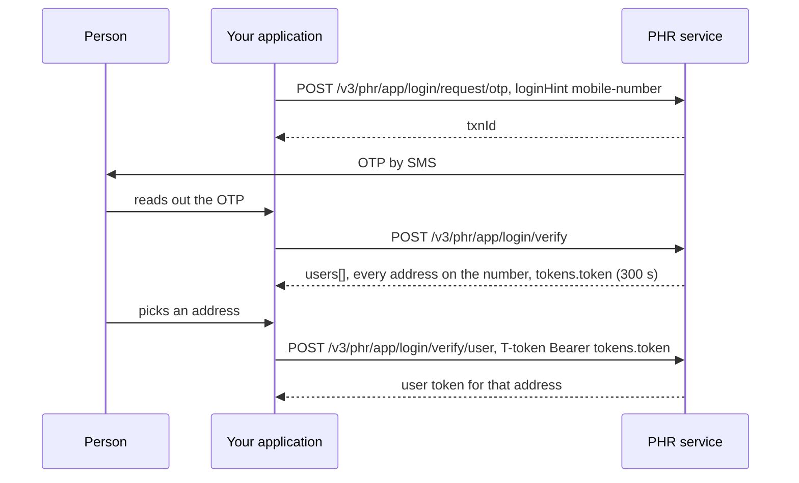

# List every ABHA address on a mobile and sign one in

## In plain words

[Log somebody in](hiecm.flow.m1-login-by-mobile) through
`/v3/profile/login` lists [ABHA numbers](shared.glossary.abha-number),
which are always [KYC](shared.glossary.kyc) verified. A person who
holds only a self declared [ABHA address](shared.glossary.abha-address)
has no number and does not appear. This flow uses the PHR login on
`/v3/phr/app/login` instead, which lists every address on the mobile,
pending ones included, and signs the person in to the one they pick.

Use it at a desk when the profile login says a number has no account
and the person insists they have one.

## Before you start

- A gateway access token. See [the gateway session](hiecm.concept.gateway-session).
- The mobile number encrypted with the **PHR** key from [the PHR certificate](hiecm.endpoint.p1-get-certificate-public-key), not the profile key. See [the two public keys](hiecm.concept.two-public-keys).
- The person present to read an OTP.

## What happens

1. [Send the OTP](hiecm.endpoint.p1-login-request-otp) with
   `scope: ["abha-address-login", "mobile-verify"]`,
   `loginHint: "mobile-number"` and `otpSystem: "abdm"`. The hint is
   exactly `mobile-number`; `mobile` is refused with
   `ABDM-9999 Invalid Login Hint`.
2. [Verify it](hiecm.endpoint.p1-login-verify-otp). The response carries
   `users[]`, one entry per address with `abhaAddress`, `abhaNumber`
   (`null` for a self declared address), `fullName`, `kycStatus` of
   `VERIFIED` or `PENDING`, and `status`; and `tokens.token`, a 300
   second transfer token.
3. [Say which address](hiecm.endpoint.p1-login-verify-user), sending
   `T-token: Bearer <tokens.token>` with the chosen `abhaAddress` and
   the `txnId`. Without the header the call answers 401 with an empty
   body.

Only the `/phr/app/` path lists by mobile. The `/phr/web/login/abha`
variant with the same hint answers `ABDM-9999 User not found`.

## How you know it worked

The verify response lists every address on the number, pending ones
with `abhaNumber: null` included, and the final call returns a user
token for the address the person chose. A profile read with that token
returns that address.

## When it goes wrong

- `ABDM-1006 Invalid mobile number` on a number you know is right. The
  number was encrypted with the profile key. Use the PHR key. See
  [ABDM-1006](hiecm.error.abdm-1006).
- `ABDM-9999 Invalid Login Hint`. The hint was `mobile`. Send
  `mobile-number`.
- `ABDM-9999 Invalid Transaction Id` on verify. The `txnId` is not from
  a live request. Start again.
- 401 with an empty body on the final call. The `T-token` header is
  missing.
- ABDM fails and does not say why. See [ABDM-9999](hiecm.error.abdm-9999).
