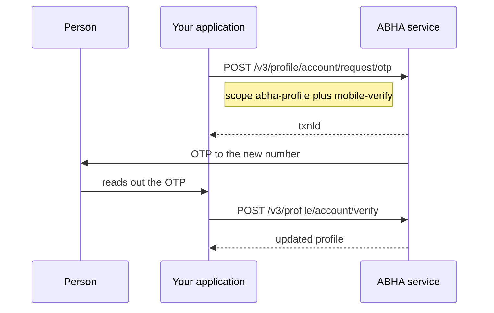

# Change the mobile number or email on an ABHA profile

## In plain words

Changing a mobile number or an email address is not a profile edit. ABDM
verifies the new value before accepting it, so it is a two call flow with
an OTP in the middle.

The same pair handles email, and setting a password, by changing the
scope.

## Before you start

- The person logged in, so you hold their `X-token`. See
  [log somebody in](m1-login-by-mobile.md).
- The new value, encrypted.
- The person present, holding the new number, because the OTP goes there.

## What happens

The `scope` array names both the area and the action, for example
`["abha-profile", "mobile-verify"]`. Send the same scope on both calls.
For email, the second element becomes `email-verify`.

## How you know it worked

Read the profile back and confirm the new value is present and marked
verified.

A successful verify response is not sufficient on its own. The profile
read is what proves the change persisted against the account you meant.

## When it goes wrong

The OTP goes to the old number. It does not: it goes to the new one,
which is the point. If the person cannot receive it, the change cannot
proceed.

The scopes do not match between the two calls, and the verify is
refused. Send the array you sent on the request.

The person is not logged in and the call is refused. See
[ABDM-2401](../errors/abdm-2401.md).

