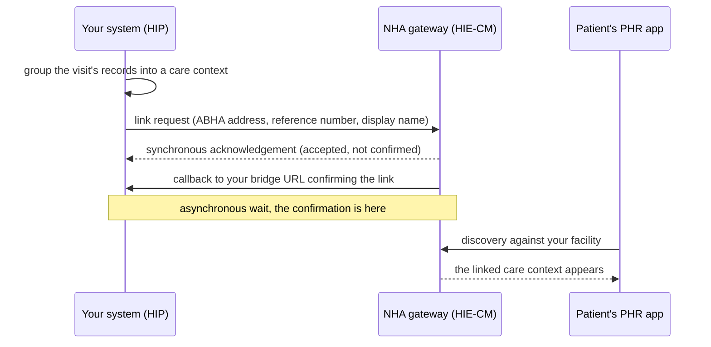

## In plain words

Linking is the M2 step where your system, acting as a HIP, attaches a
care context to the patient's ABHA address. Once linked, the patient can
see the record in their PHR app and an HIU can request it under consent.
Nothing you hold is discoverable until it is linked.

## Before you start

Three things must already be true, each checkable:

- Your facility has a valid Facility ID registered in the HIP role.
- You hold a gateway session token from the sessions endpoint
  (gateway_sessions_create in the gateway reference).
- The patient has an ABHA address, which is the M1 module's job.

## What happens

NHA's M2 document presents most request and response tables as
screenshots, so the payload shapes below are unconfirmed until the M2
swagger is ingested and run against sandbox. The sequence itself is
documented:



The endpoint atoms for each step arrive with M2 spec ingestion; until
then the M2 reference carries no operations.

## How you know it worked

The gateway's callback to your registered bridge URL reports success for
your link request, and the care context then appears when the patient's
PHR app runs discovery against your facility. Do not treat the
synchronous acknowledgement alone as success.

```observation schema=exit-condition
channel: callback
path: <YOUR_BRIDGE_URL>/on-link-confirmation
match:
  status: SUCCESS
timeout_seconds: unknown
note: exact callback path and timeout unconfirmed until M2 swagger is ingested
```

## When it goes wrong

The frequent failures NHA's sources document, in rough order of
frequency, each with its fix in the linked error atom:

- hiecm.error.abdm-1056 when the care context is already linked or the
  link reference number is invalid.
- hiecm.error.abdm-1062 when the ABHA number does not match the link
  token.
- hiecm.error.abdm-1063 when the HIP id does not match the link token.
- hiecm.error.abdm-2406 when calls are made out of the logical sequence.
